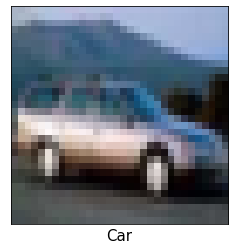
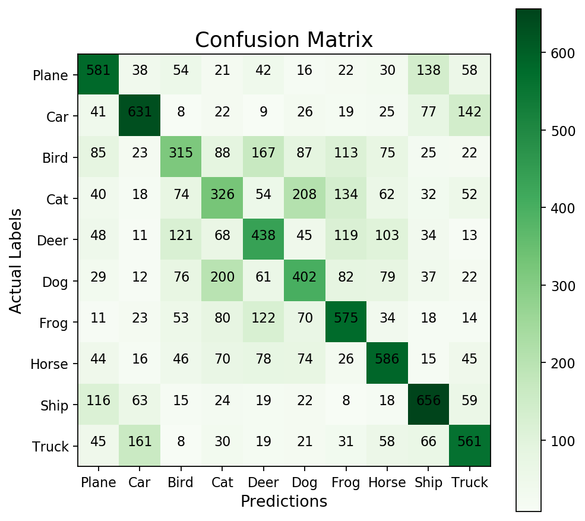

# Imports


```python
from numpy.random import seed
seed(888)
from tensorflow import set_random_seed
set_random_seed(404)
import numpy as np 
import pandas as pd
import os
import tensorflow as tf
import itertools
import keras
from keras.datasets import cifar10

from keras.models import Sequential
from keras.layers import Dense,Activation,Dropout

from IPython.display import display
from keras.preprocessing.image import array_to_img
from keras.callbacks import TensorBoard

from time import strftime

from sklearn.metrics import confusion_matrix 

import matplotlib.pyplot as plt

%matplotlib inline
```

# Constants


```python
LOG_DIR='tensorboard_cifar_logs/'

LABEL_NAMES=['Plane','Car','Bird','Cat','Deer','Dog','Frog','Horse','Ship','Truck']
IMAGE_WIDTH=32
IMAGE_HEIGHT=32
IMAGE_PIXELS=IMAGE_HEIGHT*IMAGE_WIDTH
COLOR_CHANNELS=3
TOTAL_INPUTS=IMAGE_PIXELS*COLOR_CHANNELS

VALIDATION_SIZE=10000

SMALL_TRAIN_SIZE=1000
```

# Get the Data


```python
(x_train_all,y_train_all),(x_test,y_test)=cifar10.load_data()
```

# Explore the Data


```python
pic=array_to_img(x_train_all[0])
display(pic)
```


```python
pic=array_to_img(x_train_all[7])
display(pic)
```


```python
LABEL_NAMES[y_train_all[7][0]]
```


    'Horse'


```python
plt.yticks([])
plt.xticks([])
plt.imshow(x_train_all[4])
plt.xlabel(LABEL_NAMES[y_train_all[4][0]],fontsize=15)
plt.show()
```





```python
plt.figure(figsize=[15,7])

for i in range(10):
    plt.subplot(1,10,i+1)
    plt.yticks([])
    plt.xticks([])
    plt.imshow(x_train_all[i])
    plt.xlabel(LABEL_NAMES[y_train_all[i][0]])
plt.show()
    
```


```python
nr_images,x,y,c=x_train_all.shape
print('number of images = ',nr_images)
print('x_dim = ',x)
print('y_dim = ',y)
print('channels = ',c)
```

    number of images =  50000
    x_dim =  32
    y_dim =  32
    channels =  3
    


```python
x_test.shape
```


    (10000, 32, 32, 3)


# Pre-Processing


```python
x_train_all=x_train_all/255.0
x_test=x_test/255.0
```


```python
type(x_train_all[0][0][0][0])
```


    numpy.float64


```python
x_train_all=x_train_all.reshape(x_train_all.shape[0],TOTAL_INPUTS)
```


```python
x_train_all.shape
```


    (50000, 3072)


```python
x_test=x_test.reshape(x_test.shape[0],TOTAL_INPUTS)
```


```python
x_test.shape
```


    (10000, 3072)


### Validation dataset


```python
x_val=x_train_all[:VALIDATION_SIZE]
y_val=y_train_all[:VALIDATION_SIZE]
x_val.shape
```


    (10000, 3072)


```python
x_train=x_train_all[VALIDATION_SIZE:]
y_train=y_train_all[VALIDATION_SIZE:]
x_train.shape
```


    (40000, 3072)


### Create a small dataset (for experimentation)


```python
x_train_xs=x_train[:SMALL_TRAIN_SIZE]
y_train_xs=y_train[:SMALL_TRAIN_SIZE]
x_train_xs.shape
```


    (1000, 3072)


# Define the Neural Network using Keras


```python
model_1=Sequential([
    Dense(units=128,input_dim=TOTAL_INPUTS,activation='relu',name='m1_hidden1'),
    Dense(units=64,activation='relu',name='m1_hidden2'),
    Dense(units=16,activation='relu',name='m1_hidden3'),
    Dense(units=10,activation='softmax',name='m1_output')
])
```


```python
model_2=Sequential()
model_2.add(Dropout(0.2,seed=42,input_shape=(TOTAL_INPUTS,)))
model_2.add(Dense(units=128,activation='relu',name='m2_hidden1'))
model_2.add(Dense(units=64,activation='relu',name='m2_hidden2'))
model_2.add(Dense(units=16,activation='relu',name='m2_hidden3'))
model_2.add(Dense(units=10,activation='softmax',name='m2_output'))
model_2.compile(optimizer='adam',loss='sparse_categorical_crossentropy',metrics=['accuracy'])
```


```python
model_3=Sequential()
model_3.add(Dropout(0.2,seed=42,input_shape=(TOTAL_INPUTS,)))
model_3.add(Dense(units=128,activation='relu',name='m3_hidden1'))
model_3.add(Dropout(0.25,seed=42))
model_3.add(Dense(units=64,activation='relu',name='m3_hidden2'))
model_3.add(Dense(units=16,activation='relu',name='m3_hidden3'))
model_3.add(Dense(units=10,activation='softmax',name='m3_output'))
model_3.compile(optimizer='adam',loss='sparse_categorical_crossentropy',metrics=['accuracy'])
```


```python
type(model_1)
```


    keras.engine.sequential.Sequential


```python
model_1.compile(optimizer='adam',loss='sparse_categorical_crossentropy',metrics=['accuracy'])
```


```python
model_1.summary()
```

    _________________________________________________________________
    Layer (type)                 Output Shape              Param #   
    =================================================================
    m1_hidden1 (Dense)           (None, 128)               393344    
    _________________________________________________________________
    m1_hidden2 (Dense)           (None, 64)                8256      
    _________________________________________________________________
    m1_hidden3 (Dense)           (None, 16)                1040      
    _________________________________________________________________
    m1_output (Dense)            (None, 10)                170       
    =================================================================
    Total params: 402,810
    Trainable params: 402,810
    Non-trainable params: 0
    _________________________________________________________________
    

# TensorBoard


```python
# folder_name=f'model_1 at {strftime("%H %M")}'
# print(folder_name)
```


```python
# dir_paths=os.path.join(LOG_DIR,folder_name)

# try:
#     os.makedirs(dir_paths)
# except OSError as err:
#     print(err.strerror)
# else:
#     print('Successfully created directory')
```


```python
def get_tensorboard(model_name):

    folder_name = f'{model_name} at {strftime("%H %M")}'
    dir_paths = os.path.join(LOG_DIR, folder_name)

    try:
        os.makedirs(dir_paths)
    except OSError as err:
        print(err.strerror)
    else:
        print('Successfully created directory')

    return TensorBoard(log_dir=dir_paths)
```

# Fit The Model


```python
samples_per_batch=1000
```


```python
%%time
nr_epochs=400
model_1.fit(x_train_xs,y_train_xs,batch_size=samples_per_batch,validation_data=(x_val,y_val),
            epochs=nr_epochs,callbacks=[get_tensorboard('Model 1')])
```

    Successfully created directory
    WARNING:tensorflow:From C:\Users\Sushant Lenka\.conda\envs\machineLearning\lib\site-packages\tensorflow\python\ops\math_ops.py:3066: to_int32 (from tensorflow.python.ops.math_ops) is deprecated and will be removed in a future version.
    Instructions for updating:
    Use tf.cast instead.
    Train on 1000 samples, validate on 10000 samples
    Epoch 1/400
    1000/1000 [==============================] - 0s 480us/step - loss: 2.3105 - acc: 0.1210 - val_loss: 2.5269 - val_acc: 0.1134
    Epoch 2/400
    1000/1000 [==============================] - 0s 333us/step - loss: 2.5069 - acc: 0.1090 - val_loss: 2.5358 - val_acc: 0.1358
    Epoch 3/400
    1000/1000 [==============================] - 0s 325us/step - loss: 2.4888 - acc: 0.1390 - val_loss: 2.3502 - val_acc: 0.1029
    Epoch 4/400
    1000/1000 [==============================] - 0s 372us/step - loss: 2.3245 - acc: 0.1030 - val_loss: 2.3238 - val_acc: 0.1006
    Epoch 5/400
    1000/1000 [==============================] - 0s 361us/step - loss: 2.3032 - acc: 0.1020 - val_loss: 2.3294 - val_acc: 0.1221
    Epoch 6/400
    1000/1000 [==============================] - 0s 367us/step - loss: 2.3101 - acc: 0.1230 - val_loss: 2.3080 - val_acc: 0.1558
    Epoch 7/400
    1000/1000 [==============================] - 0s 349us/step - loss: 2.2843 - acc: 0.1610 - val_loss: 2.3007 - val_acc: 0.1108
    Epoch 8/400
    1000/1000 [==============================] - 0s 358us/step - loss: 2.2779 - acc: 0.1170 - val_loss: 2.2929 - val_acc: 0.1295
    Epoch 9/400
    1000/1000 [==============================] - 0s 347us/step - loss: 2.2682 - acc: 0.1450 - val_loss: 2.2852 - val_acc: 0.1623
    Epoch 10/400
    1000/1000 [==============================] - 0s 335us/step - loss: 2.2560 - acc: 0.1820 - val_loss: 2.2825 - val_acc: 0.1639
    Epoch 11/400
    1000/1000 [==============================] - 0s 345us/step - loss: 2.2457 - acc: 0.1870 - val_loss: 2.2839 - val_acc: 0.1747
    Epoch 12/400
    1000/1000 [==============================] - 0s 333us/step - loss: 2.2416 - acc: 0.2010 - val_loss: 2.2807 - val_acc: 0.1738
    Epoch 13/400
    1000/1000 [==============================] - 0s 338us/step - loss: 2.2373 - acc: 0.2020 - val_loss: 2.2739 - val_acc: 0.1703
    Epoch 14/400
    1000/1000 [==============================] - 0s 326us/step - loss: 2.2280 - acc: 0.1880 - val_loss: 2.2675 - val_acc: 0.1673
    Epoch 15/400
    1000/1000 [==============================] - 0s 368us/step - loss: 2.2192 - acc: 0.1890 - val_loss: 2.2632 - val_acc: 0.1706
    Epoch 16/400
    1000/1000 [==============================] - 0s 340us/step - loss: 2.2098 - acc: 0.1980 - val_loss: 2.2626 - val_acc: 0.1577
    Epoch 17/400
    1000/1000 [==============================] - 0s 338us/step - loss: 2.2033 - acc: 0.1780 - val_loss: 2.2457 - val_acc: 0.1759
    Epoch 18/400
    1000/1000 [==============================] - 0s 357us/step - loss: 2.1928 - acc: 0.1950 - val_loss: 2.2430 - val_acc: 0.1823
    Epoch 19/400
    1000/1000 [==============================] - 0s 338us/step - loss: 2.1864 - acc: 0.2020 - val_loss: 2.2405 - val_acc: 0.1813
    Epoch 20/400
    1000/1000 [==============================] - 0s 340us/step - loss: 2.1770 - acc: 0.2100 - val_loss: 2.2344 - val_acc: 0.1741
    Epoch 21/400
    1000/1000 [==============================] - 0s 351us/step - loss: 2.1723 - acc: 0.2060 - val_loss: 2.2301 - val_acc: 0.1818
    Epoch 22/400
    1000/1000 [==============================] - 0s 350us/step - loss: 2.1620 - acc: 0.2150 - val_loss: 2.2335 - val_acc: 0.1851
    Epoch 23/400
    1000/1000 [==============================] - 0s 369us/step - loss: 2.1556 - acc: 0.2150 - val_loss: 2.2206 - val_acc: 0.1859
    Epoch 24/400
    1000/1000 [==============================] - 0s 325us/step - loss: 2.1459 - acc: 0.2220 - val_loss: 2.2183 - val_acc: 0.1899
    Epoch 25/400
    1000/1000 [==============================] - 0s 335us/step - loss: 2.1376 - acc: 0.2400 - val_loss: 2.2178 - val_acc: 0.1899
    Epoch 26/400
    1000/1000 [==============================] - 0s 334us/step - loss: 2.1298 - acc: 0.2460 - val_loss: 2.2117 - val_acc: 0.1901
    Epoch 27/400
    1000/1000 [==============================] - 0s 325us/step - loss: 2.1216 - acc: 0.2330 - val_loss: 2.2080 - val_acc: 0.1877
    Epoch 28/400
    1000/1000 [==============================] - 0s 319us/step - loss: 2.1115 - acc: 0.2410 - val_loss: 2.1982 - val_acc: 0.1899
    Epoch 29/400
    1000/1000 [==============================] - 0s 316us/step - loss: 2.1004 - acc: 0.2480 - val_loss: 2.1916 - val_acc: 0.1932
    Epoch 30/400
    1000/1000 [==============================] - 0s 325us/step - loss: 2.0934 - acc: 0.2410 - val_loss: 2.1938 - val_acc: 0.1943
    Epoch 31/400
    1000/1000 [==============================] - 0s 341us/step - loss: 2.0877 - acc: 0.2560 - val_loss: 2.1846 - val_acc: 0.1909
    Epoch 32/400
    1000/1000 [==============================] - 0s 336us/step - loss: 2.0828 - acc: 0.2360 - val_loss: 2.1908 - val_acc: 0.1937
    Epoch 33/400
    1000/1000 [==============================] - 0s 319us/step - loss: 2.0722 - acc: 0.2570 - val_loss: 2.1748 - val_acc: 0.2017
    Epoch 34/400
    1000/1000 [==============================] - 0s 316us/step - loss: 2.0584 - acc: 0.2580 - val_loss: 2.1674 - val_acc: 0.2026
    Epoch 35/400
    1000/1000 [==============================] - 0s 327us/step - loss: 2.0492 - acc: 0.2680 - val_loss: 2.1768 - val_acc: 0.2006
    Epoch 36/400
    1000/1000 [==============================] - 0s 328us/step - loss: 2.0474 - acc: 0.2620 - val_loss: 2.1630 - val_acc: 0.2094
    Epoch 37/400
    1000/1000 [==============================] - 0s 335us/step - loss: 2.0379 - acc: 0.2650 - val_loss: 2.1629 - val_acc: 0.2057
    Epoch 38/400
    1000/1000 [==============================] - 0s 327us/step - loss: 2.0247 - acc: 0.2680 - val_loss: 2.1533 - val_acc: 0.2105
    Epoch 39/400
    1000/1000 [==============================] - 0s 353us/step - loss: 2.0148 - acc: 0.2760 - val_loss: 2.1464 - val_acc: 0.2143
    Epoch 40/400
    1000/1000 [==============================] - 0s 355us/step - loss: 2.0074 - acc: 0.2840 - val_loss: 2.1496 - val_acc: 0.2082
    Epoch 41/400
    1000/1000 [==============================] - 0s 322us/step - loss: 2.0028 - acc: 0.2680 - val_loss: 2.1370 - val_acc: 0.2204
    Epoch 42/400
    1000/1000 [==============================] - 0s 325us/step - loss: 1.9957 - acc: 0.3030 - val_loss: 2.1419 - val_acc: 0.2133
    Epoch 43/400
    1000/1000 [==============================] - 0s 325us/step - loss: 1.9859 - acc: 0.2730 - val_loss: 2.1322 - val_acc: 0.2206
    Epoch 44/400
    1000/1000 [==============================] - 0s 358us/step - loss: 1.9733 - acc: 0.2960 - val_loss: 2.1293 - val_acc: 0.2223
    Epoch 45/400
    1000/1000 [==============================] - 0s 371us/step - loss: 1.9644 - acc: 0.2980 - val_loss: 2.1290 - val_acc: 0.2212
    Epoch 46/400
    1000/1000 [==============================] - 0s 357us/step - loss: 1.9580 - acc: 0.2900 - val_loss: 2.1220 - val_acc: 0.2296
    Epoch 47/400
    1000/1000 [==============================] - 0s 369us/step - loss: 1.9511 - acc: 0.3260 - val_loss: 2.1293 - val_acc: 0.2210
    Epoch 48/400
    1000/1000 [==============================] - 0s 377us/step - loss: 1.9432 - acc: 0.2910 - val_loss: 2.1158 - val_acc: 0.2337
    Epoch 49/400
    1000/1000 [==============================] - 0s 342us/step - loss: 1.9329 - acc: 0.3260 - val_loss: 2.1128 - val_acc: 0.2295
    Epoch 50/400
    1000/1000 [==============================] - 0s 331us/step - loss: 1.9230 - acc: 0.3260 - val_loss: 2.1083 - val_acc: 0.2360
    Epoch 51/400
    1000/1000 [==============================] - 0s 349us/step - loss: 1.9134 - acc: 0.3310 - val_loss: 2.1060 - val_acc: 0.2359
    Epoch 52/400
    1000/1000 [==============================] - 0s 350us/step - loss: 1.9047 - acc: 0.3380 - val_loss: 2.1082 - val_acc: 0.2308
    Epoch 53/400
    1000/1000 [==============================] - 0s 348us/step - loss: 1.8975 - acc: 0.3290 - val_loss: 2.1010 - val_acc: 0.2430
    Epoch 54/400
    1000/1000 [==============================] - 0s 333us/step - loss: 1.8923 - acc: 0.3550 - val_loss: 2.1138 - val_acc: 0.2326
    Epoch 55/400
    1000/1000 [==============================] - 0s 343us/step - loss: 1.8897 - acc: 0.3200 - val_loss: 2.1005 - val_acc: 0.2499
    Epoch 56/400
    1000/1000 [==============================] - 0s 323us/step - loss: 1.8843 - acc: 0.3640 - val_loss: 2.1048 - val_acc: 0.2407
    Epoch 57/400
    1000/1000 [==============================] - 0s 316us/step - loss: 1.8659 - acc: 0.3450 - val_loss: 2.0814 - val_acc: 0.2623
    Epoch 58/400
    1000/1000 [==============================] - 0s 314us/step - loss: 1.8438 - acc: 0.3830 - val_loss: 2.0722 - val_acc: 0.2702
    Epoch 59/400
    1000/1000 [==============================] - 0s 327us/step - loss: 1.8341 - acc: 0.4040 - val_loss: 2.0817 - val_acc: 0.2657
    Epoch 60/400
    1000/1000 [==============================] - 0s 332us/step - loss: 1.8282 - acc: 0.3780 - val_loss: 2.0648 - val_acc: 0.2757
    Epoch 61/400
    1000/1000 [==============================] - 0s 342us/step - loss: 1.8178 - acc: 0.4110 - val_loss: 2.0564 - val_acc: 0.2787
    Epoch 62/400
    1000/1000 [==============================] - 0s 321us/step - loss: 1.8004 - acc: 0.4030 - val_loss: 2.0436 - val_acc: 0.2845
    Epoch 63/400
    1000/1000 [==============================] - 0s 334us/step - loss: 1.7860 - acc: 0.4210 - val_loss: 2.0398 - val_acc: 0.2887
    Epoch 64/400
    1000/1000 [==============================] - 0s 363us/step - loss: 1.7816 - acc: 0.4290 - val_loss: 2.0447 - val_acc: 0.2802
    Epoch 65/400
    1000/1000 [==============================] - 0s 317us/step - loss: 1.7754 - acc: 0.4030 - val_loss: 2.0212 - val_acc: 0.2936
    Epoch 66/400
    1000/1000 [==============================] - 0s 315us/step - loss: 1.7596 - acc: 0.4380 - val_loss: 2.0255 - val_acc: 0.2902
    Epoch 67/400
    1000/1000 [==============================] - 0s 324us/step - loss: 1.7457 - acc: 0.4300 - val_loss: 2.0164 - val_acc: 0.2862
    Epoch 68/400
    1000/1000 [==============================] - 0s 319us/step - loss: 1.7339 - acc: 0.4340 - val_loss: 2.0080 - val_acc: 0.2964
    Epoch 69/400
    1000/1000 [==============================] - 0s 334us/step - loss: 1.7292 - acc: 0.4490 - val_loss: 2.0274 - val_acc: 0.2839
    Epoch 70/400
    1000/1000 [==============================] - 0s 316us/step - loss: 1.7214 - acc: 0.4390 - val_loss: 2.0022 - val_acc: 0.2956
    Epoch 71/400
    1000/1000 [==============================] - 0s 333us/step - loss: 1.7044 - acc: 0.4430 - val_loss: 2.0017 - val_acc: 0.2936
    Epoch 72/400
    1000/1000 [==============================] - 0s 331us/step - loss: 1.6928 - acc: 0.4410 - val_loss: 2.0071 - val_acc: 0.2904
    Epoch 73/400
    1000/1000 [==============================] - 0s 347us/step - loss: 1.6853 - acc: 0.4430 - val_loss: 1.9943 - val_acc: 0.2986
    Epoch 74/400
    1000/1000 [==============================] - 0s 337us/step - loss: 1.6773 - acc: 0.4580 - val_loss: 2.0002 - val_acc: 0.2954
    Epoch 75/400
    1000/1000 [==============================] - 0s 322us/step - loss: 1.6719 - acc: 0.4470 - val_loss: 1.9945 - val_acc: 0.3005
    Epoch 76/400
    1000/1000 [==============================] - 0s 324us/step - loss: 1.6638 - acc: 0.4630 - val_loss: 2.0022 - val_acc: 0.2924
    Epoch 77/400
    1000/1000 [==============================] - 0s 345us/step - loss: 1.6545 - acc: 0.4470 - val_loss: 1.9870 - val_acc: 0.3019
    Epoch 78/400
    1000/1000 [==============================] - 0s 331us/step - loss: 1.6437 - acc: 0.4760 - val_loss: 1.9968 - val_acc: 0.2936
    Epoch 79/400
    1000/1000 [==============================] - 0s 317us/step - loss: 1.6318 - acc: 0.4600 - val_loss: 1.9761 - val_acc: 0.3051
    Epoch 80/400
    1000/1000 [==============================] - 0s 336us/step - loss: 1.6191 - acc: 0.4690 - val_loss: 1.9790 - val_acc: 0.3018
    Epoch 81/400
    1000/1000 [==============================] - 0s 330us/step - loss: 1.6073 - acc: 0.4710 - val_loss: 1.9782 - val_acc: 0.3038
    Epoch 82/400
    1000/1000 [==============================] - 0s 329us/step - loss: 1.5984 - acc: 0.4740 - val_loss: 1.9718 - val_acc: 0.3036
    Epoch 83/400
    1000/1000 [==============================] - 0s 347us/step - loss: 1.5897 - acc: 0.4690 - val_loss: 1.9774 - val_acc: 0.3012
    Epoch 84/400
    1000/1000 [==============================] - 0s 334us/step - loss: 1.5805 - acc: 0.4750 - val_loss: 1.9703 - val_acc: 0.3064
    Epoch 85/400
    1000/1000 [==============================] - 0s 336us/step - loss: 1.5720 - acc: 0.4860 - val_loss: 1.9780 - val_acc: 0.2992
    Epoch 86/400
    1000/1000 [==============================] - 0s 328us/step - loss: 1.5647 - acc: 0.4820 - val_loss: 1.9748 - val_acc: 0.3049
    Epoch 87/400
    1000/1000 [==============================] - 0s 336us/step - loss: 1.5615 - acc: 0.4880 - val_loss: 2.0001 - val_acc: 0.2934
    Epoch 88/400
    1000/1000 [==============================] - 0s 320us/step - loss: 1.5664 - acc: 0.4740 - val_loss: 2.0033 - val_acc: 0.3026
    Epoch 89/400
    1000/1000 [==============================] - 0s 319us/step - loss: 1.5861 - acc: 0.4710 - val_loss: 2.0586 - val_acc: 0.2783
    Epoch 90/400
    1000/1000 [==============================] - 0s 352us/step - loss: 1.5982 - acc: 0.4460 - val_loss: 1.9854 - val_acc: 0.3088
    Epoch 91/400
    1000/1000 [==============================] - 0s 362us/step - loss: 1.5575 - acc: 0.4890 - val_loss: 1.9741 - val_acc: 0.3062
    Epoch 92/400
    1000/1000 [==============================] - 0s 352us/step - loss: 1.5221 - acc: 0.5090 - val_loss: 2.0229 - val_acc: 0.2837
    Epoch 93/400
    1000/1000 [==============================] - 0s 342us/step - loss: 1.5528 - acc: 0.4570 - val_loss: 1.9887 - val_acc: 0.3085
    Epoch 94/400
    1000/1000 [==============================] - 0s 332us/step - loss: 1.5368 - acc: 0.4970 - val_loss: 1.9840 - val_acc: 0.3062
    Epoch 95/400
    1000/1000 [==============================] - 0s 316us/step - loss: 1.5030 - acc: 0.5140 - val_loss: 2.0212 - val_acc: 0.2884
    Epoch 96/400
    1000/1000 [==============================] - 0s 320us/step - loss: 1.5312 - acc: 0.4650 - val_loss: 1.9827 - val_acc: 0.3113
    Epoch 97/400
    1000/1000 [==============================] - 0s 311us/step - loss: 1.5123 - acc: 0.5120 - val_loss: 1.9917 - val_acc: 0.3018
    Epoch 98/400
    1000/1000 [==============================] - 0s 332us/step - loss: 1.4908 - acc: 0.5180 - val_loss: 2.0008 - val_acc: 0.2970
    Epoch 99/400
    1000/1000 [==============================] - 0s 321us/step - loss: 1.4932 - acc: 0.4990 - val_loss: 1.9771 - val_acc: 0.3161
    Epoch 100/400
    1000/1000 [==============================] - 0s 318us/step - loss: 1.4873 - acc: 0.5220 - val_loss: 1.9816 - val_acc: 0.3103
    Epoch 101/400
    1000/1000 [==============================] - 0s 313us/step - loss: 1.4638 - acc: 0.5280 - val_loss: 1.9993 - val_acc: 0.3002
    Epoch 102/400
    1000/1000 [==============================] - 0s 315us/step - loss: 1.4691 - acc: 0.5040 - val_loss: 1.9685 - val_acc: 0.3154
    Epoch 103/400
    1000/1000 [==============================] - 0s 325us/step - loss: 1.4553 - acc: 0.5330 - val_loss: 1.9710 - val_acc: 0.3147
    Epoch 104/400
    1000/1000 [==============================] - 0s 325us/step - loss: 1.4398 - acc: 0.5380 - val_loss: 2.0008 - val_acc: 0.3008
    Epoch 105/400
    1000/1000 [==============================] - 0s 316us/step - loss: 1.4501 - acc: 0.5090 - val_loss: 1.9669 - val_acc: 0.3194
    Epoch 106/400
    1000/1000 [==============================] - 0s 315us/step - loss: 1.4284 - acc: 0.5400 - val_loss: 1.9776 - val_acc: 0.3137
    Epoch 107/400
    1000/1000 [==============================] - 0s 331us/step - loss: 1.4243 - acc: 0.5380 - val_loss: 1.9919 - val_acc: 0.3055
    Epoch 108/400
    1000/1000 [==============================] - 0s 312us/step - loss: 1.4212 - acc: 0.5280 - val_loss: 1.9768 - val_acc: 0.3157
    Epoch 109/400
    1000/1000 [==============================] - 0s 323us/step - loss: 1.4163 - acc: 0.5340 - val_loss: 1.9758 - val_acc: 0.3124
    Epoch 110/400
    1000/1000 [==============================] - 0s 313us/step - loss: 1.3992 - acc: 0.5530 - val_loss: 1.9885 - val_acc: 0.3053
    Epoch 111/400
    1000/1000 [==============================] - 0s 311us/step - loss: 1.4040 - acc: 0.5240 - val_loss: 1.9764 - val_acc: 0.3171
    Epoch 112/400
    1000/1000 [==============================] - 0s 316us/step - loss: 1.3993 - acc: 0.5430 - val_loss: 1.9964 - val_acc: 0.3087
    Epoch 113/400
    1000/1000 [==============================] - 0s 318us/step - loss: 1.3885 - acc: 0.5490 - val_loss: 1.9789 - val_acc: 0.3120
    Epoch 114/400
    1000/1000 [==============================] - 0s 334us/step - loss: 1.3754 - acc: 0.5450 - val_loss: 1.9745 - val_acc: 0.3178
    Epoch 115/400
    1000/1000 [==============================] - 0s 312us/step - loss: 1.3741 - acc: 0.5500 - val_loss: 2.0050 - val_acc: 0.3090
    Epoch 116/400
    1000/1000 [==============================] - 0s 319us/step - loss: 1.3734 - acc: 0.5530 - val_loss: 1.9737 - val_acc: 0.3188
    Epoch 117/400
    1000/1000 [==============================] - 0s 337us/step - loss: 1.3555 - acc: 0.5610 - val_loss: 1.9745 - val_acc: 0.3180
    Epoch 118/400
    1000/1000 [==============================] - 0s 322us/step - loss: 1.3494 - acc: 0.5560 - val_loss: 1.9908 - val_acc: 0.3139
    Epoch 119/400
    1000/1000 [==============================] - 0s 317us/step - loss: 1.3444 - acc: 0.5600 - val_loss: 1.9822 - val_acc: 0.3194
    Epoch 120/400
    1000/1000 [==============================] - 0s 313us/step - loss: 1.3434 - acc: 0.5700 - val_loss: 1.9805 - val_acc: 0.3180
    Epoch 121/400
    1000/1000 [==============================] - 0s 319us/step - loss: 1.3255 - acc: 0.5680 - val_loss: 1.9891 - val_acc: 0.3165
    Epoch 122/400
    1000/1000 [==============================] - 0s 335us/step - loss: 1.3256 - acc: 0.5680 - val_loss: 1.9809 - val_acc: 0.3189
    Epoch 123/400
    1000/1000 [==============================] - 0s 318us/step - loss: 1.3233 - acc: 0.5740 - val_loss: 1.9954 - val_acc: 0.3138
    Epoch 124/400
    1000/1000 [==============================] - 0s 314us/step - loss: 1.3136 - acc: 0.5770 - val_loss: 1.9796 - val_acc: 0.3204
    Epoch 125/400
    1000/1000 [==============================] - 0s 325us/step - loss: 1.3049 - acc: 0.5820 - val_loss: 1.9820 - val_acc: 0.3206
    Epoch 126/400
    1000/1000 [==============================] - 0s 325us/step - loss: 1.2951 - acc: 0.5850 - val_loss: 1.9987 - val_acc: 0.3179
    Epoch 127/400
    1000/1000 [==============================] - 0s 320us/step - loss: 1.2940 - acc: 0.5850 - val_loss: 1.9827 - val_acc: 0.3201
    Epoch 128/400
    1000/1000 [==============================] - 0s 317us/step - loss: 1.2851 - acc: 0.5870 - val_loss: 1.9982 - val_acc: 0.3182
    Epoch 129/400
    1000/1000 [==============================] - 0s 346us/step - loss: 1.2820 - acc: 0.5750 - val_loss: 1.9933 - val_acc: 0.3222
    Epoch 130/400
    1000/1000 [==============================] - 0s 321us/step - loss: 1.2771 - acc: 0.5930 - val_loss: 2.0021 - val_acc: 0.3177
    Epoch 131/400
    1000/1000 [==============================] - 0s 325us/step - loss: 1.2695 - acc: 0.5840 - val_loss: 1.9922 - val_acc: 0.3202
    Epoch 132/400
    1000/1000 [==============================] - 0s 351us/step - loss: 1.2625 - acc: 0.5970 - val_loss: 1.9938 - val_acc: 0.3224
    Epoch 133/400
    1000/1000 [==============================] - 0s 332us/step - loss: 1.2503 - acc: 0.6090 - val_loss: 1.9944 - val_acc: 0.3215
    Epoch 134/400
    1000/1000 [==============================] - 0s 322us/step - loss: 1.2462 - acc: 0.6110 - val_loss: 1.9989 - val_acc: 0.3219
    Epoch 135/400
    1000/1000 [==============================] - 0s 325us/step - loss: 1.2402 - acc: 0.6020 - val_loss: 2.0031 - val_acc: 0.3192
    Epoch 136/400
    1000/1000 [==============================] - 0s 335us/step - loss: 1.2354 - acc: 0.5950 - val_loss: 2.0056 - val_acc: 0.3209
    Epoch 137/400
    1000/1000 [==============================] - 0s 331us/step - loss: 1.2312 - acc: 0.6130 - val_loss: 2.0097 - val_acc: 0.3206
    Epoch 138/400
    1000/1000 [==============================] - 0s 353us/step - loss: 1.2236 - acc: 0.6060 - val_loss: 2.0009 - val_acc: 0.3222
    Epoch 139/400
    1000/1000 [==============================] - 0s 329us/step - loss: 1.2245 - acc: 0.6060 - val_loss: 2.0512 - val_acc: 0.3094
    Epoch 140/400
    1000/1000 [==============================] - 0s 312us/step - loss: 1.2364 - acc: 0.5890 - val_loss: 2.0450 - val_acc: 0.3179
    Epoch 141/400
    1000/1000 [==============================] - 0s 319us/step - loss: 1.2734 - acc: 0.5860 - val_loss: 2.0953 - val_acc: 0.3042
    Epoch 142/400
    1000/1000 [==============================] - 0s 325us/step - loss: 1.2601 - acc: 0.5760 - val_loss: 2.0173 - val_acc: 0.3210
    Epoch 143/400
    1000/1000 [==============================] - 0s 349us/step - loss: 1.2261 - acc: 0.6110 - val_loss: 2.0090 - val_acc: 0.3223
    Epoch 144/400
    1000/1000 [==============================] - 0s 361us/step - loss: 1.1916 - acc: 0.6190 - val_loss: 2.0608 - val_acc: 0.3132
    Epoch 145/400
    1000/1000 [==============================] - 0s 317us/step - loss: 1.2185 - acc: 0.5970 - val_loss: 2.0360 - val_acc: 0.3213
    Epoch 146/400
    1000/1000 [==============================] - 0s 356us/step - loss: 1.2304 - acc: 0.6100 - val_loss: 2.0323 - val_acc: 0.3185
    Epoch 147/400
    1000/1000 [==============================] - 0s 327us/step - loss: 1.1867 - acc: 0.6150 - val_loss: 2.0659 - val_acc: 0.3162
    Epoch 148/400
    1000/1000 [==============================] - 0s 322us/step - loss: 1.2055 - acc: 0.6190 - val_loss: 2.0392 - val_acc: 0.3195
    Epoch 149/400
    1000/1000 [==============================] - 0s 319us/step - loss: 1.2117 - acc: 0.6170 - val_loss: 2.0233 - val_acc: 0.3248
    Epoch 150/400
    1000/1000 [==============================] - 0s 340us/step - loss: 1.1635 - acc: 0.6270 - val_loss: 2.0556 - val_acc: 0.3198
    Epoch 151/400
    1000/1000 [==============================] - 0s 342us/step - loss: 1.1816 - acc: 0.6320 - val_loss: 2.0476 - val_acc: 0.3180
    Epoch 152/400
    1000/1000 [==============================] - 0s 316us/step - loss: 1.1891 - acc: 0.6200 - val_loss: 2.0345 - val_acc: 0.3225
    Epoch 153/400
    1000/1000 [==============================] - 0s 324us/step - loss: 1.1487 - acc: 0.6360 - val_loss: 2.0761 - val_acc: 0.3167
    Epoch 154/400
    1000/1000 [==============================] - 0s 329us/step - loss: 1.1663 - acc: 0.6320 - val_loss: 2.0414 - val_acc: 0.3227
    Epoch 155/400
    1000/1000 [==============================] - 0s 327us/step - loss: 1.1611 - acc: 0.6420 - val_loss: 2.0269 - val_acc: 0.3261
    Epoch 156/400
    1000/1000 [==============================] - 0s 316us/step - loss: 1.1267 - acc: 0.6500 - val_loss: 2.0734 - val_acc: 0.3187
    Epoch 157/400
    1000/1000 [==============================] - 0s 334us/step - loss: 1.1503 - acc: 0.6310 - val_loss: 2.0444 - val_acc: 0.3205
    Epoch 158/400
    1000/1000 [==============================] - 0s 313us/step - loss: 1.1486 - acc: 0.6450 - val_loss: 2.0451 - val_acc: 0.3221
    Epoch 159/400
    1000/1000 [==============================] - 0s 320us/step - loss: 1.1220 - acc: 0.6440 - val_loss: 2.0684 - val_acc: 0.3207
    Epoch 160/400
    1000/1000 [==============================] - 0s 324us/step - loss: 1.1398 - acc: 0.6460 - val_loss: 2.0565 - val_acc: 0.3194
    Epoch 161/400
    1000/1000 [==============================] - 0s 315us/step - loss: 1.1272 - acc: 0.6440 - val_loss: 2.0428 - val_acc: 0.3252
    Epoch 162/400
    1000/1000 [==============================] - 0s 334us/step - loss: 1.0978 - acc: 0.6550 - val_loss: 2.0732 - val_acc: 0.3238
    Epoch 163/400
    1000/1000 [==============================] - 0s 322us/step - loss: 1.1106 - acc: 0.6470 - val_loss: 2.0519 - val_acc: 0.3256
    Epoch 164/400
    1000/1000 [==============================] - 0s 318us/step - loss: 1.1029 - acc: 0.6640 - val_loss: 2.0390 - val_acc: 0.3257
    Epoch 165/400
    1000/1000 [==============================] - 0s 316us/step - loss: 1.0871 - acc: 0.6550 - val_loss: 2.0870 - val_acc: 0.3188
    Epoch 166/400
    1000/1000 [==============================] - 0s 328us/step - loss: 1.1021 - acc: 0.6460 - val_loss: 2.0514 - val_acc: 0.3242
    Epoch 167/400
    1000/1000 [==============================] - 0s 318us/step - loss: 1.0897 - acc: 0.6650 - val_loss: 2.0587 - val_acc: 0.3224
    Epoch 168/400
    1000/1000 [==============================] - 0s 316us/step - loss: 1.0780 - acc: 0.6700 - val_loss: 2.0729 - val_acc: 0.3233
    Epoch 169/400
    1000/1000 [==============================] - 0s 315us/step - loss: 1.0818 - acc: 0.6560 - val_loss: 2.0519 - val_acc: 0.3222
    Epoch 170/400
    1000/1000 [==============================] - 0s 339us/step - loss: 1.0612 - acc: 0.6670 - val_loss: 2.0592 - val_acc: 0.3238
    Epoch 171/400
    1000/1000 [==============================] - 0s 323us/step - loss: 1.0552 - acc: 0.6720 - val_loss: 2.0747 - val_acc: 0.3259
    Epoch 172/400
    1000/1000 [==============================] - 0s 315us/step - loss: 1.0639 - acc: 0.6620 - val_loss: 2.0732 - val_acc: 0.3236
    Epoch 173/400
    1000/1000 [==============================] - 0s 323us/step - loss: 1.0557 - acc: 0.6750 - val_loss: 2.0643 - val_acc: 0.3239
    Epoch 174/400
    1000/1000 [==============================] - 0s 334us/step - loss: 1.0479 - acc: 0.6760 - val_loss: 2.1044 - val_acc: 0.3190
    Epoch 175/400
    1000/1000 [==============================] - 0s 343us/step - loss: 1.0542 - acc: 0.6740 - val_loss: 2.0661 - val_acc: 0.3246
    Epoch 176/400
    1000/1000 [==============================] - 0s 324us/step - loss: 1.0419 - acc: 0.6780 - val_loss: 2.0710 - val_acc: 0.3228
    Epoch 177/400
    1000/1000 [==============================] - 0s 320us/step - loss: 1.0288 - acc: 0.6900 - val_loss: 2.0799 - val_acc: 0.3270
    Epoch 178/400
    1000/1000 [==============================] - 0s 341us/step - loss: 1.0288 - acc: 0.6780 - val_loss: 2.0736 - val_acc: 0.3233
    Epoch 179/400
    1000/1000 [==============================] - 0s 337us/step - loss: 1.0199 - acc: 0.6830 - val_loss: 2.0815 - val_acc: 0.3253
    Epoch 180/400
    1000/1000 [==============================] - 0s 323us/step - loss: 1.0091 - acc: 0.7010 - val_loss: 2.0941 - val_acc: 0.3257
    Epoch 181/400
    1000/1000 [==============================] - 0s 329us/step - loss: 1.0158 - acc: 0.6810 - val_loss: 2.0997 - val_acc: 0.3223
    Epoch 182/400
    1000/1000 [==============================] - 0s 347us/step - loss: 1.0141 - acc: 0.6890 - val_loss: 2.0875 - val_acc: 0.3255
    Epoch 183/400
    1000/1000 [==============================] - 0s 325us/step - loss: 1.0102 - acc: 0.6910 - val_loss: 2.1275 - val_acc: 0.3152
    Epoch 184/400
    1000/1000 [==============================] - 0s 327us/step - loss: 1.0194 - acc: 0.6760 - val_loss: 2.0971 - val_acc: 0.3247
    Epoch 185/400
    1000/1000 [==============================] - 0s 336us/step - loss: 1.0203 - acc: 0.6870 - val_loss: 2.1142 - val_acc: 0.3185
    Epoch 186/400
    1000/1000 [==============================] - 0s 339us/step - loss: 0.9984 - acc: 0.6990 - val_loss: 2.1028 - val_acc: 0.3267
    Epoch 187/400
    1000/1000 [==============================] - 0s 331us/step - loss: 0.9863 - acc: 0.6940 - val_loss: 2.0989 - val_acc: 0.3222
    Epoch 188/400
    1000/1000 [==============================] - 0s 316us/step - loss: 0.9781 - acc: 0.7070 - val_loss: 2.0991 - val_acc: 0.3251
    Epoch 189/400
    1000/1000 [==============================] - 0s 321us/step - loss: 0.9669 - acc: 0.7140 - val_loss: 2.1011 - val_acc: 0.3296
    Epoch 190/400
    1000/1000 [==============================] - 0s 332us/step - loss: 0.9705 - acc: 0.6970 - val_loss: 2.1315 - val_acc: 0.3205
    Epoch 191/400
    1000/1000 [==============================] - 0s 321us/step - loss: 0.9789 - acc: 0.6990 - val_loss: 2.1300 - val_acc: 0.3234
    Epoch 192/400
    1000/1000 [==============================] - 0s 330us/step - loss: 0.9814 - acc: 0.6930 - val_loss: 2.1678 - val_acc: 0.3150
    Epoch 193/400
    1000/1000 [==============================] - 0s 316us/step - loss: 0.9852 - acc: 0.6940 - val_loss: 2.1252 - val_acc: 0.3252
    Epoch 194/400
    1000/1000 [==============================] - 0s 315us/step - loss: 0.9884 - acc: 0.7000 - val_loss: 2.1342 - val_acc: 0.3194
    Epoch 195/400
    1000/1000 [==============================] - 0s 325us/step - loss: 0.9584 - acc: 0.7130 - val_loss: 2.1091 - val_acc: 0.3254
    Epoch 196/400
    1000/1000 [==============================] - 0s 318us/step - loss: 0.9373 - acc: 0.7230 - val_loss: 2.1127 - val_acc: 0.3251
    Epoch 197/400
    1000/1000 [==============================] - 0s 318us/step - loss: 0.9359 - acc: 0.7260 - val_loss: 2.1559 - val_acc: 0.3195
    Epoch 198/400
    1000/1000 [==============================] - 0s 323us/step - loss: 0.9467 - acc: 0.7230 - val_loss: 2.1416 - val_acc: 0.3273
    Epoch 199/400
    1000/1000 [==============================] - 0s 342us/step - loss: 0.9552 - acc: 0.7140 - val_loss: 2.1926 - val_acc: 0.3143
    Epoch 200/400
    1000/1000 [==============================] - 0s 323us/step - loss: 0.9639 - acc: 0.6890 - val_loss: 2.1456 - val_acc: 0.3282
    Epoch 201/400
    1000/1000 [==============================] - 0s 335us/step - loss: 0.9455 - acc: 0.7080 - val_loss: 2.1399 - val_acc: 0.3197
    Epoch 202/400
    1000/1000 [==============================] - 0s 315us/step - loss: 0.9166 - acc: 0.7310 - val_loss: 2.1283 - val_acc: 0.3278
    Epoch 203/400
    1000/1000 [==============================] - 0s 326us/step - loss: 0.9046 - acc: 0.7390 - val_loss: 2.1435 - val_acc: 0.3271
    Epoch 204/400
    1000/1000 [==============================] - 0s 344us/step - loss: 0.9124 - acc: 0.7300 - val_loss: 2.1818 - val_acc: 0.3166
    Epoch 205/400
    1000/1000 [==============================] - 0s 330us/step - loss: 0.9198 - acc: 0.7210 - val_loss: 2.1556 - val_acc: 0.3256
    Epoch 206/400
    1000/1000 [==============================] - 0s 334us/step - loss: 0.9161 - acc: 0.7280 - val_loss: 2.1766 - val_acc: 0.3209
    Epoch 207/400
    1000/1000 [==============================] - 0s 314us/step - loss: 0.9031 - acc: 0.7270 - val_loss: 2.1396 - val_acc: 0.3284
    Epoch 208/400
    1000/1000 [==============================] - 0s 332us/step - loss: 0.8856 - acc: 0.7450 - val_loss: 2.1494 - val_acc: 0.3253
    Epoch 209/400
    1000/1000 [==============================] - 0s 342us/step - loss: 0.8789 - acc: 0.7420 - val_loss: 2.1742 - val_acc: 0.3216
    Epoch 210/400
    1000/1000 [==============================] - 0s 334us/step - loss: 0.8810 - acc: 0.7410 - val_loss: 2.1620 - val_acc: 0.3273
    Epoch 211/400
    1000/1000 [==============================] - 0s 317us/step - loss: 0.8884 - acc: 0.7390 - val_loss: 2.1993 - val_acc: 0.3200
    Epoch 212/400
    1000/1000 [==============================] - 0s 316us/step - loss: 0.8814 - acc: 0.7350 - val_loss: 2.1643 - val_acc: 0.3262
    Epoch 213/400
    1000/1000 [==============================] - 0s 314us/step - loss: 0.8689 - acc: 0.7460 - val_loss: 2.1727 - val_acc: 0.3238
    Epoch 214/400
    1000/1000 [==============================] - 0s 321us/step - loss: 0.8574 - acc: 0.7530 - val_loss: 2.1722 - val_acc: 0.3298
    Epoch 215/400
    1000/1000 [==============================] - 0s 315us/step - loss: 0.8518 - acc: 0.7580 - val_loss: 2.1689 - val_acc: 0.3272
    Epoch 216/400
    1000/1000 [==============================] - 0s 320us/step - loss: 0.8474 - acc: 0.7560 - val_loss: 2.1897 - val_acc: 0.3229
    Epoch 217/400
    1000/1000 [==============================] - 0s 315us/step - loss: 0.8451 - acc: 0.7560 - val_loss: 2.1781 - val_acc: 0.3269
    Epoch 218/400
    1000/1000 [==============================] - 0s 319us/step - loss: 0.8434 - acc: 0.7550 - val_loss: 2.1984 - val_acc: 0.3214
    Epoch 219/400
    1000/1000 [==============================] - 0s 322us/step - loss: 0.8400 - acc: 0.7550 - val_loss: 2.1869 - val_acc: 0.3286
    Epoch 220/400
    1000/1000 [==============================] - 0s 330us/step - loss: 0.8341 - acc: 0.7600 - val_loss: 2.2026 - val_acc: 0.3233
    Epoch 221/400
    1000/1000 [==============================] - 0s 316us/step - loss: 0.8281 - acc: 0.7680 - val_loss: 2.1903 - val_acc: 0.3283
    Epoch 222/400
    1000/1000 [==============================] - 0s 341us/step - loss: 0.8196 - acc: 0.7730 - val_loss: 2.1935 - val_acc: 0.3264
    Epoch 223/400
    1000/1000 [==============================] - 0s 321us/step - loss: 0.8133 - acc: 0.7810 - val_loss: 2.2049 - val_acc: 0.3263
    Epoch 224/400
    1000/1000 [==============================] - 0s 355us/step - loss: 0.8088 - acc: 0.7790 - val_loss: 2.2030 - val_acc: 0.3271
    Epoch 225/400
    1000/1000 [==============================] - 0s 318us/step - loss: 0.8057 - acc: 0.7760 - val_loss: 2.2187 - val_acc: 0.3241
    Epoch 226/400
    1000/1000 [==============================] - 0s 317us/step - loss: 0.8030 - acc: 0.7770 - val_loss: 2.2101 - val_acc: 0.3278
    Epoch 227/400
    1000/1000 [==============================] - 0s 319us/step - loss: 0.8021 - acc: 0.7760 - val_loss: 2.2363 - val_acc: 0.3203
    Epoch 228/400
    1000/1000 [==============================] - 0s 317us/step - loss: 0.8028 - acc: 0.7690 - val_loss: 2.2244 - val_acc: 0.3268
    Epoch 229/400
    1000/1000 [==============================] - 0s 323us/step - loss: 0.8036 - acc: 0.7700 - val_loss: 2.2640 - val_acc: 0.3168
    Epoch 230/400
    1000/1000 [==============================] - 0s 333us/step - loss: 0.8075 - acc: 0.7600 - val_loss: 2.2356 - val_acc: 0.3276
    Epoch 231/400
    1000/1000 [==============================] - 0s 319us/step - loss: 0.8100 - acc: 0.7700 - val_loss: 2.2919 - val_acc: 0.3158
    Epoch 232/400
    1000/1000 [==============================] - 0s 324us/step - loss: 0.8126 - acc: 0.7560 - val_loss: 2.2481 - val_acc: 0.3266
    Epoch 233/400
    1000/1000 [==============================] - 0s 332us/step - loss: 0.8090 - acc: 0.7660 - val_loss: 2.2963 - val_acc: 0.3173
    Epoch 234/400
    1000/1000 [==============================] - 0s 315us/step - loss: 0.7994 - acc: 0.7560 - val_loss: 2.2462 - val_acc: 0.3237
    Epoch 235/400
    1000/1000 [==============================] - 0s 342us/step - loss: 0.7857 - acc: 0.7880 - val_loss: 2.2682 - val_acc: 0.3230
    Epoch 236/400
    1000/1000 [==============================] - 0s 335us/step - loss: 0.7726 - acc: 0.7760 - val_loss: 2.2530 - val_acc: 0.3217
    Epoch 237/400
    1000/1000 [==============================] - 0s 335us/step - loss: 0.7657 - acc: 0.7900 - val_loss: 2.2613 - val_acc: 0.3285
    Epoch 238/400
    1000/1000 [==============================] - 0s 332us/step - loss: 0.7640 - acc: 0.7800 - val_loss: 2.3025 - val_acc: 0.3183
    Epoch 239/400
    1000/1000 [==============================] - 0s 346us/step - loss: 0.7722 - acc: 0.7730 - val_loss: 2.2726 - val_acc: 0.3270
    Epoch 240/400
    1000/1000 [==============================] - 0s 320us/step - loss: 0.7723 - acc: 0.7880 - val_loss: 2.3211 - val_acc: 0.3161
    Epoch 241/400
    1000/1000 [==============================] - 0s 348us/step - loss: 0.7706 - acc: 0.7700 - val_loss: 2.2704 - val_acc: 0.3238
    Epoch 242/400
    1000/1000 [==============================] - 0s 334us/step - loss: 0.7615 - acc: 0.7990 - val_loss: 2.3050 - val_acc: 0.3202
    Epoch 243/400
    1000/1000 [==============================] - 0s 327us/step - loss: 0.7478 - acc: 0.7830 - val_loss: 2.2983 - val_acc: 0.3210
    Epoch 244/400
    1000/1000 [==============================] - 0s 341us/step - loss: 0.7457 - acc: 0.7930 - val_loss: 2.2980 - val_acc: 0.3261
    Epoch 245/400
    1000/1000 [==============================] - 0s 346us/step - loss: 0.7467 - acc: 0.7810 - val_loss: 2.3289 - val_acc: 0.3178
    Epoch 246/400
    1000/1000 [==============================] - 0s 336us/step - loss: 0.7471 - acc: 0.7820 - val_loss: 2.2883 - val_acc: 0.3270
    Epoch 247/400
    1000/1000 [==============================] - 0s 385us/step - loss: 0.7357 - acc: 0.7980 - val_loss: 2.3281 - val_acc: 0.3203
    Epoch 248/400
    1000/1000 [==============================] - 0s 380us/step - loss: 0.7283 - acc: 0.7950 - val_loss: 2.3071 - val_acc: 0.3214
    Epoch 249/400
    1000/1000 [==============================] - 0s 352us/step - loss: 0.7305 - acc: 0.8020 - val_loss: 2.3446 - val_acc: 0.3197
    Epoch 250/400
    1000/1000 [==============================] - 0s 320us/step - loss: 0.7357 - acc: 0.7830 - val_loss: 2.3476 - val_acc: 0.3133
    Epoch 251/400
    1000/1000 [==============================] - 0s 327us/step - loss: 0.7387 - acc: 0.7920 - val_loss: 2.3243 - val_acc: 0.3269
    Epoch 252/400
    1000/1000 [==============================] - 0s 335us/step - loss: 0.7126 - acc: 0.7990 - val_loss: 2.3257 - val_acc: 0.3233
    Epoch 253/400
    1000/1000 [==============================] - 0s 312us/step - loss: 0.6953 - acc: 0.8200 - val_loss: 2.3188 - val_acc: 0.3254
    Epoch 254/400
    1000/1000 [==============================] - 0s 330us/step - loss: 0.7035 - acc: 0.8070 - val_loss: 2.3659 - val_acc: 0.3190
    Epoch 255/400
    1000/1000 [==============================] - 0s 335us/step - loss: 0.7140 - acc: 0.7900 - val_loss: 2.3549 - val_acc: 0.3182
    Epoch 256/400
    1000/1000 [==============================] - 0s 323us/step - loss: 0.7117 - acc: 0.7990 - val_loss: 2.3557 - val_acc: 0.3211
    Epoch 257/400
    1000/1000 [==============================] - 0s 337us/step - loss: 0.6941 - acc: 0.7980 - val_loss: 2.3285 - val_acc: 0.3261
    Epoch 258/400
    1000/1000 [==============================] - 0s 366us/step - loss: 0.6737 - acc: 0.8250 - val_loss: 2.3413 - val_acc: 0.3216
    Epoch 259/400
    1000/1000 [==============================] - 0s 342us/step - loss: 0.6764 - acc: 0.8190 - val_loss: 2.3775 - val_acc: 0.3204
    Epoch 260/400
    1000/1000 [==============================] - 0s 342us/step - loss: 0.6951 - acc: 0.7940 - val_loss: 2.3629 - val_acc: 0.3213
    Epoch 261/400
    1000/1000 [==============================] - 0s 338us/step - loss: 0.6936 - acc: 0.8060 - val_loss: 2.3747 - val_acc: 0.3208
    Epoch 262/400
    1000/1000 [==============================] - 0s 335us/step - loss: 0.6723 - acc: 0.8170 - val_loss: 2.3489 - val_acc: 0.3247
    Epoch 263/400
    1000/1000 [==============================] - 0s 323us/step - loss: 0.6610 - acc: 0.8250 - val_loss: 2.3884 - val_acc: 0.3164
    Epoch 264/400
    1000/1000 [==============================] - 0s 348us/step - loss: 0.6689 - acc: 0.8140 - val_loss: 2.3834 - val_acc: 0.3249
    Epoch 265/400
    1000/1000 [==============================] - 0s 334us/step - loss: 0.6728 - acc: 0.8090 - val_loss: 2.3762 - val_acc: 0.3218
    Epoch 266/400
    1000/1000 [==============================] - 0s 352us/step - loss: 0.6602 - acc: 0.8210 - val_loss: 2.3754 - val_acc: 0.3208
    Epoch 267/400
    1000/1000 [==============================] - 0s 365us/step - loss: 0.6459 - acc: 0.8270 - val_loss: 2.3722 - val_acc: 0.3267
    Epoch 268/400
    1000/1000 [==============================] - 0s 408us/step - loss: 0.6431 - acc: 0.8290 - val_loss: 2.3917 - val_acc: 0.3209
    Epoch 269/400
    1000/1000 [==============================] - 0s 369us/step - loss: 0.6499 - acc: 0.8300 - val_loss: 2.4058 - val_acc: 0.3212
    Epoch 270/400
    1000/1000 [==============================] - 0s 368us/step - loss: 0.6484 - acc: 0.8200 - val_loss: 2.4060 - val_acc: 0.3185
    Epoch 271/400
    1000/1000 [==============================] - 0s 354us/step - loss: 0.6410 - acc: 0.8240 - val_loss: 2.3923 - val_acc: 0.3214
    Epoch 272/400
    1000/1000 [==============================] - 0s 344us/step - loss: 0.6224 - acc: 0.8390 - val_loss: 2.4077 - val_acc: 0.3250
    Epoch 273/400
    1000/1000 [==============================] - 0s 359us/step - loss: 0.6350 - acc: 0.8310 - val_loss: 2.4245 - val_acc: 0.3191
    Epoch 274/400
    1000/1000 [==============================] - 0s 364us/step - loss: 0.6453 - acc: 0.8190 - val_loss: 2.4285 - val_acc: 0.3199
    Epoch 275/400
    1000/1000 [==============================] - 0s 370us/step - loss: 0.6289 - acc: 0.8270 - val_loss: 2.4172 - val_acc: 0.3220
    Epoch 276/400
    1000/1000 [==============================] - 0s 394us/step - loss: 0.6079 - acc: 0.8460 - val_loss: 2.4119 - val_acc: 0.3238
    Epoch 277/400
    1000/1000 [==============================] - 0s 348us/step - loss: 0.6254 - acc: 0.8390 - val_loss: 2.4531 - val_acc: 0.3175
    Epoch 278/400
    1000/1000 [==============================] - 0s 333us/step - loss: 0.6258 - acc: 0.8240 - val_loss: 2.4300 - val_acc: 0.3211
    Epoch 279/400
    1000/1000 [==============================] - 0s 353us/step - loss: 0.6201 - acc: 0.8280 - val_loss: 2.4720 - val_acc: 0.3170
    Epoch 280/400
    1000/1000 [==============================] - 0s 362us/step - loss: 0.6197 - acc: 0.8340 - val_loss: 2.4536 - val_acc: 0.3203
    Epoch 281/400
    1000/1000 [==============================] - 0s 342us/step - loss: 0.6397 - acc: 0.8260 - val_loss: 2.5129 - val_acc: 0.3101
    Epoch 282/400
    1000/1000 [==============================] - 0s 378us/step - loss: 0.6400 - acc: 0.8180 - val_loss: 2.4946 - val_acc: 0.3124
    Epoch 283/400
    1000/1000 [==============================] - 0s 346us/step - loss: 0.6706 - acc: 0.8120 - val_loss: 2.5651 - val_acc: 0.3087
    Epoch 284/400
    1000/1000 [==============================] - 0s 363us/step - loss: 0.6636 - acc: 0.8050 - val_loss: 2.4507 - val_acc: 0.3278
    Epoch 285/400
    1000/1000 [==============================] - 0s 368us/step - loss: 0.6187 - acc: 0.8350 - val_loss: 2.4913 - val_acc: 0.3201
    Epoch 286/400
    1000/1000 [==============================] - 0s 388us/step - loss: 0.6004 - acc: 0.8390 - val_loss: 2.5274 - val_acc: 0.3105
    Epoch 287/400
    1000/1000 [==============================] - 0s 344us/step - loss: 0.6289 - acc: 0.8160 - val_loss: 2.4979 - val_acc: 0.3208
    Epoch 288/400
    1000/1000 [==============================] - 0s 362us/step - loss: 0.6257 - acc: 0.8250 - val_loss: 2.4631 - val_acc: 0.3192
    Epoch 289/400
    1000/1000 [==============================] - 0s 387us/step - loss: 0.5920 - acc: 0.8450 - val_loss: 2.5151 - val_acc: 0.3100
    Epoch 290/400
    1000/1000 [==============================] - 0s 384us/step - loss: 0.6154 - acc: 0.8300 - val_loss: 2.5245 - val_acc: 0.3113
    Epoch 291/400
    1000/1000 [==============================] - 0s 331us/step - loss: 0.6091 - acc: 0.8300 - val_loss: 2.5030 - val_acc: 0.3221
    Epoch 292/400
    1000/1000 [==============================] - 0s 344us/step - loss: 0.5987 - acc: 0.8280 - val_loss: 2.5321 - val_acc: 0.3181
    Epoch 293/400
    1000/1000 [==============================] - 0s 329us/step - loss: 0.5982 - acc: 0.8310 - val_loss: 2.4973 - val_acc: 0.3206
    Epoch 294/400
    1000/1000 [==============================] - 0s 334us/step - loss: 0.5715 - acc: 0.8530 - val_loss: 2.5016 - val_acc: 0.3160
    Epoch 295/400
    1000/1000 [==============================] - 0s 385us/step - loss: 0.5817 - acc: 0.8390 - val_loss: 2.5276 - val_acc: 0.3183
    Epoch 296/400
    1000/1000 [==============================] - 0s 371us/step - loss: 0.5749 - acc: 0.8470 - val_loss: 2.4849 - val_acc: 0.3218
    Epoch 297/400
    1000/1000 [==============================] - 0s 371us/step - loss: 0.5548 - acc: 0.8700 - val_loss: 2.5289 - val_acc: 0.3115
    Epoch 298/400
    1000/1000 [==============================] - 0s 371us/step - loss: 0.5647 - acc: 0.8520 - val_loss: 2.5246 - val_acc: 0.3183
    Epoch 299/400
    1000/1000 [==============================] - 0s 363us/step - loss: 0.5526 - acc: 0.8540 - val_loss: 2.5084 - val_acc: 0.3228
    Epoch 300/400
    1000/1000 [==============================] - 0s 356us/step - loss: 0.5388 - acc: 0.8670 - val_loss: 2.5260 - val_acc: 0.3199
    Epoch 301/400
    1000/1000 [==============================] - 0s 395us/step - loss: 0.5510 - acc: 0.8620 - val_loss: 2.5078 - val_acc: 0.3234
    Epoch 302/400
    1000/1000 [==============================] - 0s 375us/step - loss: 0.5385 - acc: 0.8670 - val_loss: 2.5527 - val_acc: 0.3131
    Epoch 303/400
    1000/1000 [==============================] - 0s 387us/step - loss: 0.5443 - acc: 0.8610 - val_loss: 2.5147 - val_acc: 0.3212
    Epoch 304/400
    1000/1000 [==============================] - 0s 359us/step - loss: 0.5399 - acc: 0.8660 - val_loss: 2.5409 - val_acc: 0.3207
    Epoch 305/400
    1000/1000 [==============================] - 0s 348us/step - loss: 0.5284 - acc: 0.8720 - val_loss: 2.5415 - val_acc: 0.3171
    Epoch 306/400
    1000/1000 [==============================] - 0s 372us/step - loss: 0.5246 - acc: 0.8640 - val_loss: 2.5464 - val_acc: 0.3221
    Epoch 307/400
    1000/1000 [==============================] - 0s 346us/step - loss: 0.5181 - acc: 0.8760 - val_loss: 2.5510 - val_acc: 0.3224
    Epoch 308/400
    1000/1000 [==============================] - 0s 360us/step - loss: 0.5128 - acc: 0.8800 - val_loss: 2.5477 - val_acc: 0.3178
    Epoch 309/400
    1000/1000 [==============================] - 0s 352us/step - loss: 0.5178 - acc: 0.8670 - val_loss: 2.5596 - val_acc: 0.3185
    Epoch 310/400
    1000/1000 [==============================] - 0s 347us/step - loss: 0.5099 - acc: 0.8780 - val_loss: 2.5399 - val_acc: 0.3220
    Epoch 311/400
    1000/1000 [==============================] - 0s 382us/step - loss: 0.5109 - acc: 0.8800 - val_loss: 2.5760 - val_acc: 0.3171
    Epoch 312/400
    1000/1000 [==============================] - 0s 344us/step - loss: 0.5078 - acc: 0.8800 - val_loss: 2.5509 - val_acc: 0.3212
    Epoch 313/400
    1000/1000 [==============================] - 0s 354us/step - loss: 0.4984 - acc: 0.8810 - val_loss: 2.5743 - val_acc: 0.3214
    Epoch 314/400
    1000/1000 [==============================] - 0s 338us/step - loss: 0.4952 - acc: 0.8810 - val_loss: 2.5809 - val_acc: 0.3196
    Epoch 315/400
    1000/1000 [==============================] - 0s 341us/step - loss: 0.4914 - acc: 0.8820 - val_loss: 2.5772 - val_acc: 0.3221
    Epoch 316/400
    1000/1000 [==============================] - 0s 345us/step - loss: 0.4865 - acc: 0.8840 - val_loss: 2.5834 - val_acc: 0.3212
    Epoch 317/400
    1000/1000 [==============================] - 0s 353us/step - loss: 0.4869 - acc: 0.8830 - val_loss: 2.5777 - val_acc: 0.3195
    Epoch 318/400
    1000/1000 [==============================] - 0s 323us/step - loss: 0.4830 - acc: 0.8860 - val_loss: 2.6007 - val_acc: 0.3188
    Epoch 319/400
    1000/1000 [==============================] - 0s 332us/step - loss: 0.4806 - acc: 0.8910 - val_loss: 2.5886 - val_acc: 0.3207
    Epoch 320/400
    1000/1000 [==============================] - 0s 338us/step - loss: 0.4798 - acc: 0.8900 - val_loss: 2.6213 - val_acc: 0.3199
    Epoch 321/400
    1000/1000 [==============================] - 0s 321us/step - loss: 0.4772 - acc: 0.8890 - val_loss: 2.6019 - val_acc: 0.3199
    Epoch 322/400
    1000/1000 [==============================] - 0s 323us/step - loss: 0.4755 - acc: 0.8860 - val_loss: 2.6379 - val_acc: 0.3164
    Epoch 323/400
    1000/1000 [==============================] - 0s 316us/step - loss: 0.4762 - acc: 0.8920 - val_loss: 2.6062 - val_acc: 0.3197
    Epoch 324/400
    1000/1000 [==============================] - 0s 322us/step - loss: 0.4770 - acc: 0.8880 - val_loss: 2.6651 - val_acc: 0.3107
    Epoch 325/400
    1000/1000 [==============================] - 0s 322us/step - loss: 0.4838 - acc: 0.8790 - val_loss: 2.6246 - val_acc: 0.3187
    Epoch 326/400
    1000/1000 [==============================] - 0s 338us/step - loss: 0.4942 - acc: 0.8800 - val_loss: 2.7232 - val_acc: 0.3076
    Epoch 327/400
    1000/1000 [==============================] - 0s 334us/step - loss: 0.5047 - acc: 0.8750 - val_loss: 2.6681 - val_acc: 0.3161
    Epoch 328/400
    1000/1000 [==============================] - 0s 357us/step - loss: 0.5269 - acc: 0.8570 - val_loss: 2.7810 - val_acc: 0.3029
    Epoch 329/400
    1000/1000 [==============================] - 0s 334us/step - loss: 0.5338 - acc: 0.8580 - val_loss: 2.6865 - val_acc: 0.3137
    Epoch 330/400
    1000/1000 [==============================] - 0s 365us/step - loss: 0.5474 - acc: 0.8480 - val_loss: 2.7331 - val_acc: 0.3053
    Epoch 331/400
    1000/1000 [==============================] - 0s 336us/step - loss: 0.5029 - acc: 0.8740 - val_loss: 2.6279 - val_acc: 0.3179
    Epoch 332/400
    1000/1000 [==============================] - 0s 334us/step - loss: 0.4610 - acc: 0.8990 - val_loss: 2.6397 - val_acc: 0.3192
    Epoch 333/400
    1000/1000 [==============================] - 0s 334us/step - loss: 0.4515 - acc: 0.8940 - val_loss: 2.7295 - val_acc: 0.3108
    Epoch 334/400
    1000/1000 [==============================] - 0s 332us/step - loss: 0.4717 - acc: 0.8910 - val_loss: 2.6696 - val_acc: 0.3189
    Epoch 335/400
    1000/1000 [==============================] - 0s 352us/step - loss: 0.4886 - acc: 0.8740 - val_loss: 2.7347 - val_acc: 0.3114
    Epoch 336/400
    1000/1000 [==============================] - 0s 352us/step - loss: 0.4715 - acc: 0.8830 - val_loss: 2.6619 - val_acc: 0.3188
    Epoch 337/400
    1000/1000 [==============================] - 0s 355us/step - loss: 0.4453 - acc: 0.8990 - val_loss: 2.6649 - val_acc: 0.3201
    Epoch 338/400
    1000/1000 [==============================] - 0s 379us/step - loss: 0.4342 - acc: 0.9040 - val_loss: 2.7243 - val_acc: 0.3129
    Epoch 339/400
    1000/1000 [==============================] - 0s 345us/step - loss: 0.4448 - acc: 0.9010 - val_loss: 2.6828 - val_acc: 0.3191
    Epoch 340/400
    1000/1000 [==============================] - 0s 349us/step - loss: 0.4528 - acc: 0.8940 - val_loss: 2.7236 - val_acc: 0.3122
    Epoch 341/400
    1000/1000 [==============================] - 0s 352us/step - loss: 0.4417 - acc: 0.8960 - val_loss: 2.6801 - val_acc: 0.3205
    Epoch 342/400
    1000/1000 [==============================] - 0s 322us/step - loss: 0.4250 - acc: 0.9100 - val_loss: 2.6888 - val_acc: 0.3185
    Epoch 343/400
    1000/1000 [==============================] - 0s 325us/step - loss: 0.4230 - acc: 0.9050 - val_loss: 2.7494 - val_acc: 0.3134
    Epoch 344/400
    1000/1000 [==============================] - 0s 338us/step - loss: 0.4314 - acc: 0.9020 - val_loss: 2.7068 - val_acc: 0.3174
    Epoch 345/400
    1000/1000 [==============================] - 0s 334us/step - loss: 0.4347 - acc: 0.9010 - val_loss: 2.7430 - val_acc: 0.3142
    Epoch 346/400
    1000/1000 [==============================] - 0s 346us/step - loss: 0.4231 - acc: 0.9090 - val_loss: 2.7033 - val_acc: 0.3185
    Epoch 347/400
    1000/1000 [==============================] - 0s 319us/step - loss: 0.4086 - acc: 0.9140 - val_loss: 2.7088 - val_acc: 0.3182
    Epoch 348/400
    1000/1000 [==============================] - 0s 335us/step - loss: 0.4099 - acc: 0.9120 - val_loss: 2.7662 - val_acc: 0.3131
    Epoch 349/400
    1000/1000 [==============================] - 0s 339us/step - loss: 0.4166 - acc: 0.9070 - val_loss: 2.7232 - val_acc: 0.3178
    Epoch 350/400
    1000/1000 [==============================] - 0s 339us/step - loss: 0.4135 - acc: 0.9090 - val_loss: 2.7538 - val_acc: 0.3160
    Epoch 351/400
    1000/1000 [==============================] - 0s 348us/step - loss: 0.4054 - acc: 0.9170 - val_loss: 2.7357 - val_acc: 0.3178
    Epoch 352/400
    1000/1000 [==============================] - 0s 312us/step - loss: 0.3980 - acc: 0.9150 - val_loss: 2.7437 - val_acc: 0.3166
    Epoch 353/400
    1000/1000 [==============================] - 0s 327us/step - loss: 0.3969 - acc: 0.9220 - val_loss: 2.7749 - val_acc: 0.3137
    Epoch 354/400
    1000/1000 [==============================] - 0s 333us/step - loss: 0.3996 - acc: 0.9160 - val_loss: 2.7446 - val_acc: 0.3180
    Epoch 355/400
    1000/1000 [==============================] - 0s 333us/step - loss: 0.3964 - acc: 0.9180 - val_loss: 2.7678 - val_acc: 0.3177
    Epoch 356/400
    1000/1000 [==============================] - 0s 346us/step - loss: 0.3905 - acc: 0.9230 - val_loss: 2.7554 - val_acc: 0.3169
    Epoch 357/400
    1000/1000 [==============================] - 0s 325us/step - loss: 0.3862 - acc: 0.9260 - val_loss: 2.7679 - val_acc: 0.3170
    Epoch 358/400
    1000/1000 [==============================] - 0s 336us/step - loss: 0.3842 - acc: 0.9290 - val_loss: 2.7894 - val_acc: 0.3157
    Epoch 359/400
    1000/1000 [==============================] - 0s 335us/step - loss: 0.3828 - acc: 0.9260 - val_loss: 2.7755 - val_acc: 0.3165
    Epoch 360/400
    1000/1000 [==============================] - 0s 316us/step - loss: 0.3810 - acc: 0.9240 - val_loss: 2.7990 - val_acc: 0.3161
    Epoch 361/400
    1000/1000 [==============================] - 0s 323us/step - loss: 0.3788 - acc: 0.9260 - val_loss: 2.7830 - val_acc: 0.3172
    Epoch 362/400
    1000/1000 [==============================] - 0s 317us/step - loss: 0.3775 - acc: 0.9250 - val_loss: 2.8014 - val_acc: 0.3143
    Epoch 363/400
    1000/1000 [==============================] - 0s 334us/step - loss: 0.3747 - acc: 0.9270 - val_loss: 2.7985 - val_acc: 0.3168
    Epoch 364/400
    1000/1000 [==============================] - 0s 336us/step - loss: 0.3709 - acc: 0.9270 - val_loss: 2.8070 - val_acc: 0.3174
    Epoch 365/400
    1000/1000 [==============================] - 0s 322us/step - loss: 0.3674 - acc: 0.9330 - val_loss: 2.8100 - val_acc: 0.3171
    Epoch 366/400
    1000/1000 [==============================] - 0s 322us/step - loss: 0.3647 - acc: 0.9330 - val_loss: 2.8173 - val_acc: 0.3162
    Epoch 367/400
    1000/1000 [==============================] - 0s 313us/step - loss: 0.3631 - acc: 0.9300 - val_loss: 2.8236 - val_acc: 0.3148
    Epoch 368/400
    1000/1000 [==============================] - 0s 325us/step - loss: 0.3617 - acc: 0.9330 - val_loss: 2.8294 - val_acc: 0.3156
    Epoch 369/400
    1000/1000 [==============================] - 0s 326us/step - loss: 0.3597 - acc: 0.9310 - val_loss: 2.8394 - val_acc: 0.3152
    Epoch 370/400
    1000/1000 [==============================] - 0s 331us/step - loss: 0.3576 - acc: 0.9350 - val_loss: 2.8332 - val_acc: 0.3151
    Epoch 371/400
    1000/1000 [==============================] - 0s 333us/step - loss: 0.3555 - acc: 0.9340 - val_loss: 2.8532 - val_acc: 0.3161
    Epoch 372/400
    1000/1000 [==============================] - 0s 318us/step - loss: 0.3531 - acc: 0.9340 - val_loss: 2.8414 - val_acc: 0.3146
    Epoch 373/400
    1000/1000 [==============================] - 0s 318us/step - loss: 0.3513 - acc: 0.9350 - val_loss: 2.8696 - val_acc: 0.3142
    Epoch 374/400
    1000/1000 [==============================] - 0s 335us/step - loss: 0.3503 - acc: 0.9340 - val_loss: 2.8493 - val_acc: 0.3157
    Epoch 375/400
    1000/1000 [==============================] - 0s 317us/step - loss: 0.3507 - acc: 0.9340 - val_loss: 2.8927 - val_acc: 0.3125
    Epoch 376/400
    1000/1000 [==============================] - 0s 344us/step - loss: 0.3509 - acc: 0.9360 - val_loss: 2.8601 - val_acc: 0.3143
    Epoch 377/400
    1000/1000 [==============================] - 0s 331us/step - loss: 0.3522 - acc: 0.9320 - val_loss: 2.9188 - val_acc: 0.3094
    Epoch 378/400
    1000/1000 [==============================] - 0s 337us/step - loss: 0.3533 - acc: 0.9330 - val_loss: 2.8658 - val_acc: 0.3145
    Epoch 379/400
    1000/1000 [==============================] - 0s 337us/step - loss: 0.3551 - acc: 0.9240 - val_loss: 2.9277 - val_acc: 0.3092
    Epoch 380/400
    1000/1000 [==============================] - 0s 320us/step - loss: 0.3523 - acc: 0.9300 - val_loss: 2.8800 - val_acc: 0.3141
    Epoch 381/400
    1000/1000 [==============================] - 0s 341us/step - loss: 0.3507 - acc: 0.9250 - val_loss: 2.9309 - val_acc: 0.3109
    Epoch 382/400
    1000/1000 [==============================] - 0s 331us/step - loss: 0.3432 - acc: 0.9360 - val_loss: 2.8839 - val_acc: 0.3156
    Epoch 383/400
    1000/1000 [==============================] - 0s 317us/step - loss: 0.3358 - acc: 0.9380 - val_loss: 2.9083 - val_acc: 0.3143
    Epoch 384/400
    1000/1000 [==============================] - 0s 330us/step - loss: 0.3291 - acc: 0.9430 - val_loss: 2.9066 - val_acc: 0.3149
    Epoch 385/400
    1000/1000 [==============================] - 0s 336us/step - loss: 0.3254 - acc: 0.9430 - val_loss: 2.9115 - val_acc: 0.3147
    Epoch 386/400
    1000/1000 [==============================] - 0s 347us/step - loss: 0.3245 - acc: 0.9390 - val_loss: 2.9420 - val_acc: 0.3128
    Epoch 387/400
    1000/1000 [==============================] - 0s 335us/step - loss: 0.3254 - acc: 0.9410 - val_loss: 2.9098 - val_acc: 0.3160
    Epoch 388/400
    1000/1000 [==============================] - 0s 314us/step - loss: 0.3289 - acc: 0.9410 - val_loss: 2.9702 - val_acc: 0.3081
    Epoch 389/400
    1000/1000 [==============================] - 0s 357us/step - loss: 0.3318 - acc: 0.9390 - val_loss: 2.9268 - val_acc: 0.3132
    Epoch 390/400
    1000/1000 [==============================] - 0s 325us/step - loss: 0.3352 - acc: 0.9340 - val_loss: 2.9966 - val_acc: 0.3085
    Epoch 391/400
    1000/1000 [==============================] - 0s 335us/step - loss: 0.3327 - acc: 0.9370 - val_loss: 2.9321 - val_acc: 0.3127
    Epoch 392/400
    1000/1000 [==============================] - 0s 331us/step - loss: 0.3280 - acc: 0.9380 - val_loss: 2.9749 - val_acc: 0.3093
    Epoch 393/400
    1000/1000 [==============================] - 0s 319us/step - loss: 0.3183 - acc: 0.9430 - val_loss: 2.9410 - val_acc: 0.3140
    Epoch 394/400
    1000/1000 [==============================] - 0s 338us/step - loss: 0.3096 - acc: 0.9450 - val_loss: 2.9618 - val_acc: 0.3135
    Epoch 395/400
    1000/1000 [==============================] - 0s 324us/step - loss: 0.3054 - acc: 0.9470 - val_loss: 2.9789 - val_acc: 0.3132
    Epoch 396/400
    1000/1000 [==============================] - 0s 343us/step - loss: 0.3053 - acc: 0.9490 - val_loss: 2.9639 - val_acc: 0.3163
    Epoch 397/400
    1000/1000 [==============================] - 0s 320us/step - loss: 0.3074 - acc: 0.9450 - val_loss: 3.0112 - val_acc: 0.3093
    Epoch 398/400
    1000/1000 [==============================] - 0s 316us/step - loss: 0.3105 - acc: 0.9450 - val_loss: 2.9785 - val_acc: 0.3158
    Epoch 399/400
    1000/1000 [==============================] - 0s 333us/step - loss: 0.3137 - acc: 0.9420 - val_loss: 3.0365 - val_acc: 0.3085
    Epoch 400/400
    1000/1000 [==============================] - 0s 319us/step - loss: 0.3131 - acc: 0.9410 - val_loss: 2.9793 - val_acc: 0.3148
    Wall time: 2min 35s
    


```python
%%time
nr_epochs=150
model_2.fit(x_train_xs,y_train_xs,batch_size=samples_per_batch,validation_data=(x_val,y_val),
            epochs=nr_epochs,callbacks=[get_tensorboard('Model 2')])
```

    Successfully created directory
    Train on 1000 samples, validate on 10000 samples
    Epoch 1/150
    1000/1000 [==============================] - 0s 492us/step - loss: 2.3253 - acc: 0.1040 - val_loss: 2.4738 - val_acc: 0.1030
    Epoch 2/150
    1000/1000 [==============================] - 0s 333us/step - loss: 2.4633 - acc: 0.0980 - val_loss: 2.4366 - val_acc: 0.1000
    Epoch 3/150
    1000/1000 [==============================] - 0s 332us/step - loss: 2.4060 - acc: 0.1090 - val_loss: 2.4023 - val_acc: 0.1041
    Epoch 4/150
    1000/1000 [==============================] - 0s 327us/step - loss: 2.3591 - acc: 0.0990 - val_loss: 2.3412 - val_acc: 0.1002
    Epoch 5/150
    1000/1000 [==============================] - 0s 339us/step - loss: 2.3111 - acc: 0.1100 - val_loss: 2.3128 - val_acc: 0.0968
    Epoch 6/150
    1000/1000 [==============================] - 0s 322us/step - loss: 2.2941 - acc: 0.1130 - val_loss: 2.2988 - val_acc: 0.0963
    Epoch 7/150
    1000/1000 [==============================] - 0s 324us/step - loss: 2.2839 - acc: 0.1040 - val_loss: 2.2903 - val_acc: 0.1164
    Epoch 8/150
    1000/1000 [==============================] - 0s 345us/step - loss: 2.2816 - acc: 0.1270 - val_loss: 2.2857 - val_acc: 0.1203
    Epoch 9/150
    1000/1000 [==============================] - 0s 330us/step - loss: 2.2784 - acc: 0.1230 - val_loss: 2.2773 - val_acc: 0.1113
    Epoch 10/150
    1000/1000 [==============================] - 0s 327us/step - loss: 2.2725 - acc: 0.1100 - val_loss: 2.2802 - val_acc: 0.0967
    Epoch 11/150
    1000/1000 [==============================] - 0s 336us/step - loss: 2.2638 - acc: 0.1040 - val_loss: 2.2733 - val_acc: 0.1124
    Epoch 12/150
    1000/1000 [==============================] - 0s 329us/step - loss: 2.2558 - acc: 0.1170 - val_loss: 2.2730 - val_acc: 0.1218
    Epoch 13/150
    1000/1000 [==============================] - 0s 357us/step - loss: 2.2475 - acc: 0.1460 - val_loss: 2.2640 - val_acc: 0.1252
    Epoch 14/150
    1000/1000 [==============================] - 0s 361us/step - loss: 2.2399 - acc: 0.1420 - val_loss: 2.2535 - val_acc: 0.1364
    Epoch 15/150
    1000/1000 [==============================] - 0s 350us/step - loss: 2.2279 - acc: 0.1360 - val_loss: 2.2496 - val_acc: 0.1333
    Epoch 16/150
    1000/1000 [==============================] - 0s 335us/step - loss: 2.2236 - acc: 0.1490 - val_loss: 2.2463 - val_acc: 0.1455
    Epoch 17/150
    1000/1000 [==============================] - 0s 325us/step - loss: 2.2167 - acc: 0.1560 - val_loss: 2.2440 - val_acc: 0.1512
    Epoch 18/150
    1000/1000 [==============================] - 0s 319us/step - loss: 2.2075 - acc: 0.1550 - val_loss: 2.2444 - val_acc: 0.1523
    Epoch 19/150
    1000/1000 [==============================] - 0s 322us/step - loss: 2.1980 - acc: 0.1630 - val_loss: 2.2441 - val_acc: 0.1546
    Epoch 20/150
    1000/1000 [==============================] - 0s 324us/step - loss: 2.2004 - acc: 0.1570 - val_loss: 2.2380 - val_acc: 0.1531
    Epoch 21/150
    1000/1000 [==============================] - 0s 344us/step - loss: 2.1883 - acc: 0.1680 - val_loss: 2.2348 - val_acc: 0.1549
    Epoch 22/150
    1000/1000 [==============================] - 0s 341us/step - loss: 2.1829 - acc: 0.1620 - val_loss: 2.2299 - val_acc: 0.1533
    Epoch 23/150
    1000/1000 [==============================] - 0s 341us/step - loss: 2.1739 - acc: 0.1770 - val_loss: 2.2203 - val_acc: 0.1438
    Epoch 24/150
    1000/1000 [==============================] - 0s 347us/step - loss: 2.1725 - acc: 0.1620 - val_loss: 2.2191 - val_acc: 0.1530
    Epoch 25/150
    1000/1000 [==============================] - 0s 338us/step - loss: 2.1640 - acc: 0.1790 - val_loss: 2.2221 - val_acc: 0.1588
    Epoch 26/150
    1000/1000 [==============================] - 0s 325us/step - loss: 2.1609 - acc: 0.1890 - val_loss: 2.2142 - val_acc: 0.1611
    Epoch 27/150
    1000/1000 [==============================] - 0s 327us/step - loss: 2.1530 - acc: 0.1780 - val_loss: 2.2128 - val_acc: 0.1662
    Epoch 28/150
    1000/1000 [==============================] - 0s 330us/step - loss: 2.1438 - acc: 0.1820 - val_loss: 2.2188 - val_acc: 0.1750
    Epoch 29/150
    1000/1000 [==============================] - 0s 341us/step - loss: 2.1434 - acc: 0.2100 - val_loss: 2.2078 - val_acc: 0.1724
    Epoch 30/150
    1000/1000 [==============================] - 0s 337us/step - loss: 2.1307 - acc: 0.2140 - val_loss: 2.2019 - val_acc: 0.1611
    Epoch 31/150
    1000/1000 [==============================] - 0s 325us/step - loss: 2.1253 - acc: 0.2080 - val_loss: 2.2000 - val_acc: 0.1754
    Epoch 32/150
    1000/1000 [==============================] - 0s 347us/step - loss: 2.1225 - acc: 0.2240 - val_loss: 2.2029 - val_acc: 0.1756
    Epoch 33/150
    1000/1000 [==============================] - 0s 326us/step - loss: 2.1198 - acc: 0.2180 - val_loss: 2.1915 - val_acc: 0.1834
    Epoch 34/150
    1000/1000 [==============================] - 0s 349us/step - loss: 2.1105 - acc: 0.2270 - val_loss: 2.1895 - val_acc: 0.1864
    Epoch 35/150
    1000/1000 [==============================] - 0s 359us/step - loss: 2.0988 - acc: 0.2250 - val_loss: 2.1944 - val_acc: 0.1910
    Epoch 36/150
    1000/1000 [==============================] - 0s 322us/step - loss: 2.0930 - acc: 0.2480 - val_loss: 2.1939 - val_acc: 0.1951
    Epoch 37/150
    1000/1000 [==============================] - 0s 349us/step - loss: 2.0921 - acc: 0.2410 - val_loss: 2.1819 - val_acc: 0.1947
    Epoch 38/150
    1000/1000 [==============================] - 0s 337us/step - loss: 2.0895 - acc: 0.2370 - val_loss: 2.1774 - val_acc: 0.1972
    Epoch 39/150
    1000/1000 [==============================] - 0s 347us/step - loss: 2.0762 - acc: 0.2320 - val_loss: 2.1774 - val_acc: 0.1985
    Epoch 40/150
    1000/1000 [==============================] - 0s 322us/step - loss: 2.0717 - acc: 0.2540 - val_loss: 2.1709 - val_acc: 0.2034
    Epoch 41/150
    1000/1000 [==============================] - 0s 345us/step - loss: 2.0607 - acc: 0.2510 - val_loss: 2.1694 - val_acc: 0.2067
    Epoch 42/150
    1000/1000 [==============================] - 0s 334us/step - loss: 2.0569 - acc: 0.2570 - val_loss: 2.1743 - val_acc: 0.2050
    Epoch 43/150
    1000/1000 [==============================] - 0s 332us/step - loss: 2.0494 - acc: 0.2500 - val_loss: 2.1638 - val_acc: 0.2092
    Epoch 44/150
    1000/1000 [==============================] - 0s 319us/step - loss: 2.0459 - acc: 0.2570 - val_loss: 2.1595 - val_acc: 0.2109
    Epoch 45/150
    1000/1000 [==============================] - 0s 332us/step - loss: 2.0430 - acc: 0.2720 - val_loss: 2.1628 - val_acc: 0.2109
    Epoch 46/150
    1000/1000 [==============================] - 0s 338us/step - loss: 2.0320 - acc: 0.2680 - val_loss: 2.1542 - val_acc: 0.2186
    Epoch 47/150
    1000/1000 [==============================] - 0s 324us/step - loss: 2.0221 - acc: 0.2800 - val_loss: 2.1510 - val_acc: 0.2214
    Epoch 48/150
    1000/1000 [==============================] - 0s 333us/step - loss: 2.0240 - acc: 0.2880 - val_loss: 2.1487 - val_acc: 0.2241
    Epoch 49/150
    1000/1000 [==============================] - 0s 338us/step - loss: 2.0059 - acc: 0.3030 - val_loss: 2.1496 - val_acc: 0.2195
    Epoch 50/150
    1000/1000 [==============================] - 0s 321us/step - loss: 2.0120 - acc: 0.2870 - val_loss: 2.1478 - val_acc: 0.2221
    Epoch 51/150
    1000/1000 [==============================] - 0s 345us/step - loss: 2.0034 - acc: 0.2820 - val_loss: 2.1424 - val_acc: 0.2273
    Epoch 52/150
    1000/1000 [==============================] - 0s 331us/step - loss: 1.9917 - acc: 0.2960 - val_loss: 2.1387 - val_acc: 0.2280
    Epoch 53/150
    1000/1000 [==============================] - 0s 327us/step - loss: 1.9851 - acc: 0.2990 - val_loss: 2.1346 - val_acc: 0.2286
    Epoch 54/150
    1000/1000 [==============================] - 0s 327us/step - loss: 1.9874 - acc: 0.3040 - val_loss: 2.1293 - val_acc: 0.2316
    Epoch 55/150
    1000/1000 [==============================] - 0s 343us/step - loss: 1.9777 - acc: 0.3250 - val_loss: 2.1266 - val_acc: 0.2340
    Epoch 56/150
    1000/1000 [==============================] - 0s 356us/step - loss: 1.9703 - acc: 0.3130 - val_loss: 2.1273 - val_acc: 0.2328
    Epoch 57/150
    1000/1000 [==============================] - 0s 338us/step - loss: 1.9685 - acc: 0.3100 - val_loss: 2.1238 - val_acc: 0.2339
    Epoch 58/150
    1000/1000 [==============================] - 0s 358us/step - loss: 1.9594 - acc: 0.3090 - val_loss: 2.1188 - val_acc: 0.2348
    Epoch 59/150
    1000/1000 [==============================] - 0s 326us/step - loss: 1.9507 - acc: 0.3180 - val_loss: 2.1203 - val_acc: 0.2356
    Epoch 60/150
    1000/1000 [==============================] - 0s 325us/step - loss: 1.9444 - acc: 0.3250 - val_loss: 2.1176 - val_acc: 0.2354
    Epoch 61/150
    1000/1000 [==============================] - 0s 332us/step - loss: 1.9486 - acc: 0.3130 - val_loss: 2.1120 - val_acc: 0.2371
    Epoch 62/150
    1000/1000 [==============================] - 0s 324us/step - loss: 1.9342 - acc: 0.3230 - val_loss: 2.1086 - val_acc: 0.2387
    Epoch 63/150
    1000/1000 [==============================] - 0s 324us/step - loss: 1.9222 - acc: 0.3260 - val_loss: 2.1110 - val_acc: 0.2341
    Epoch 64/150
    1000/1000 [==============================] - 0s 343us/step - loss: 1.9187 - acc: 0.3170 - val_loss: 2.1020 - val_acc: 0.2373
    Epoch 65/150
    1000/1000 [==============================] - 0s 329us/step - loss: 1.9132 - acc: 0.3290 - val_loss: 2.1067 - val_acc: 0.2348
    Epoch 66/150
    1000/1000 [==============================] - 0s 325us/step - loss: 1.9076 - acc: 0.3320 - val_loss: 2.1027 - val_acc: 0.2412
    Epoch 67/150
    1000/1000 [==============================] - 0s 331us/step - loss: 1.9014 - acc: 0.3320 - val_loss: 2.0946 - val_acc: 0.2437
    Epoch 68/150
    1000/1000 [==============================] - 0s 336us/step - loss: 1.8987 - acc: 0.3390 - val_loss: 2.0908 - val_acc: 0.2455
    Epoch 69/150
    1000/1000 [==============================] - 0s 322us/step - loss: 1.8892 - acc: 0.3330 - val_loss: 2.0827 - val_acc: 0.2488
    Epoch 70/150
    1000/1000 [==============================] - 0s 322us/step - loss: 1.8876 - acc: 0.3500 - val_loss: 2.0801 - val_acc: 0.2494
    Epoch 71/150
    1000/1000 [==============================] - 0s 327us/step - loss: 1.8778 - acc: 0.3550 - val_loss: 2.0801 - val_acc: 0.2489
    Epoch 72/150
    1000/1000 [==============================] - 0s 331us/step - loss: 1.8665 - acc: 0.3620 - val_loss: 2.0813 - val_acc: 0.2457
    Epoch 73/150
    1000/1000 [==============================] - 0s 331us/step - loss: 1.8655 - acc: 0.3380 - val_loss: 2.0810 - val_acc: 0.2481
    Epoch 74/150
    1000/1000 [==============================] - 0s 331us/step - loss: 1.8647 - acc: 0.3560 - val_loss: 2.0829 - val_acc: 0.2475
    Epoch 75/150
    1000/1000 [==============================] - 0s 349us/step - loss: 1.8508 - acc: 0.3530 - val_loss: 2.0712 - val_acc: 0.2519
    Epoch 76/150
    1000/1000 [==============================] - 0s 323us/step - loss: 1.8504 - acc: 0.3590 - val_loss: 2.0753 - val_acc: 0.2497
    Epoch 77/150
    1000/1000 [==============================] - 0s 331us/step - loss: 1.8340 - acc: 0.3760 - val_loss: 2.0668 - val_acc: 0.2547
    Epoch 78/150
    1000/1000 [==============================] - 0s 342us/step - loss: 1.8371 - acc: 0.3670 - val_loss: 2.0765 - val_acc: 0.2531
    Epoch 79/150
    1000/1000 [==============================] - 0s 349us/step - loss: 1.8233 - acc: 0.3760 - val_loss: 2.0639 - val_acc: 0.2601
    Epoch 80/150
    1000/1000 [==============================] - 0s 324us/step - loss: 1.8185 - acc: 0.3690 - val_loss: 2.0604 - val_acc: 0.2587
    Epoch 81/150
    1000/1000 [==============================] - 0s 346us/step - loss: 1.8090 - acc: 0.3790 - val_loss: 2.0716 - val_acc: 0.2564
    Epoch 82/150
    1000/1000 [==============================] - 0s 326us/step - loss: 1.8105 - acc: 0.3910 - val_loss: 2.0555 - val_acc: 0.2675
    Epoch 83/150
    1000/1000 [==============================] - 0s 326us/step - loss: 1.7964 - acc: 0.4030 - val_loss: 2.0720 - val_acc: 0.2564
    Epoch 84/150
    1000/1000 [==============================] - 0s 323us/step - loss: 1.7890 - acc: 0.3770 - val_loss: 2.0558 - val_acc: 0.2640
    Epoch 85/150
    1000/1000 [==============================] - 0s 332us/step - loss: 1.7939 - acc: 0.3840 - val_loss: 2.0628 - val_acc: 0.2620
    Epoch 86/150
    1000/1000 [==============================] - 0s 327us/step - loss: 1.7849 - acc: 0.3910 - val_loss: 2.0578 - val_acc: 0.2658
    Epoch 87/150
    1000/1000 [==============================] - 0s 333us/step - loss: 1.7813 - acc: 0.3870 - val_loss: 2.0520 - val_acc: 0.2738
    Epoch 88/150
    1000/1000 [==============================] - 0s 330us/step - loss: 1.7632 - acc: 0.4010 - val_loss: 2.0628 - val_acc: 0.2587
    Epoch 89/150
    1000/1000 [==============================] - 0s 324us/step - loss: 1.7730 - acc: 0.3940 - val_loss: 2.0451 - val_acc: 0.2711
    Epoch 90/150
    1000/1000 [==============================] - 0s 340us/step - loss: 1.7703 - acc: 0.3860 - val_loss: 2.0652 - val_acc: 0.2684
    Epoch 91/150
    1000/1000 [==============================] - 0s 333us/step - loss: 1.7655 - acc: 0.3870 - val_loss: 2.0426 - val_acc: 0.2754
    Epoch 92/150
    1000/1000 [==============================] - 0s 326us/step - loss: 1.7393 - acc: 0.4140 - val_loss: 2.0431 - val_acc: 0.2743
    Epoch 93/150
    1000/1000 [==============================] - 0s 325us/step - loss: 1.7499 - acc: 0.4180 - val_loss: 2.0961 - val_acc: 0.2605
    Epoch 94/150
    1000/1000 [==============================] - 0s 324us/step - loss: 1.7541 - acc: 0.3830 - val_loss: 2.0430 - val_acc: 0.2774
    Epoch 95/150
    1000/1000 [==============================] - 0s 323us/step - loss: 1.7455 - acc: 0.4080 - val_loss: 2.0413 - val_acc: 0.2806
    Epoch 96/150
    1000/1000 [==============================] - 0s 327us/step - loss: 1.7380 - acc: 0.4060 - val_loss: 2.0744 - val_acc: 0.2701
    Epoch 97/150
    1000/1000 [==============================] - 0s 339us/step - loss: 1.7502 - acc: 0.3990 - val_loss: 2.0308 - val_acc: 0.2804
    Epoch 98/150
    1000/1000 [==============================] - 0s 323us/step - loss: 1.7256 - acc: 0.4170 - val_loss: 2.0324 - val_acc: 0.2809
    Epoch 99/150
    1000/1000 [==============================] - 0s 318us/step - loss: 1.7215 - acc: 0.4160 - val_loss: 2.0717 - val_acc: 0.2672
    Epoch 100/150
    1000/1000 [==============================] - 0s 327us/step - loss: 1.7282 - acc: 0.3980 - val_loss: 2.0380 - val_acc: 0.2816
    Epoch 101/150
    1000/1000 [==============================] - 0s 334us/step - loss: 1.7113 - acc: 0.4410 - val_loss: 2.0288 - val_acc: 0.2822
    Epoch 102/150
    1000/1000 [==============================] - 0s 331us/step - loss: 1.6975 - acc: 0.4370 - val_loss: 2.0609 - val_acc: 0.2746
    Epoch 103/150
    1000/1000 [==============================] - 0s 322us/step - loss: 1.7011 - acc: 0.4090 - val_loss: 2.0339 - val_acc: 0.2819
    Epoch 104/150
    1000/1000 [==============================] - 0s 337us/step - loss: 1.6887 - acc: 0.4280 - val_loss: 2.0226 - val_acc: 0.2819
    Epoch 105/150
    1000/1000 [==============================] - 0s 346us/step - loss: 1.6850 - acc: 0.4270 - val_loss: 2.0601 - val_acc: 0.2752
    Epoch 106/150
    1000/1000 [==============================] - 0s 337us/step - loss: 1.6921 - acc: 0.4050 - val_loss: 2.0231 - val_acc: 0.2843
    Epoch 107/150
    1000/1000 [==============================] - 0s 318us/step - loss: 1.6733 - acc: 0.4490 - val_loss: 2.0214 - val_acc: 0.2838
    Epoch 108/150
    1000/1000 [==============================] - 0s 335us/step - loss: 1.6751 - acc: 0.4460 - val_loss: 2.0564 - val_acc: 0.2762
    Epoch 109/150
    1000/1000 [==============================] - 0s 328us/step - loss: 1.6844 - acc: 0.4200 - val_loss: 2.0246 - val_acc: 0.2844
    Epoch 110/150
    1000/1000 [==============================] - 0s 324us/step - loss: 1.6565 - acc: 0.4420 - val_loss: 2.0261 - val_acc: 0.2852
    Epoch 111/150
    1000/1000 [==============================] - 0s 344us/step - loss: 1.6711 - acc: 0.4370 - val_loss: 2.0298 - val_acc: 0.2883
    Epoch 112/150
    1000/1000 [==============================] - 0s 325us/step - loss: 1.6378 - acc: 0.4470 - val_loss: 2.0295 - val_acc: 0.2844
    Epoch 113/150
    1000/1000 [==============================] - 0s 321us/step - loss: 1.6293 - acc: 0.4480 - val_loss: 2.0197 - val_acc: 0.2848
    Epoch 114/150
    1000/1000 [==============================] - 0s 332us/step - loss: 1.6350 - acc: 0.4570 - val_loss: 2.0307 - val_acc: 0.2846
    Epoch 115/150
    1000/1000 [==============================] - 0s 325us/step - loss: 1.6200 - acc: 0.4640 - val_loss: 2.0324 - val_acc: 0.2851
    Epoch 116/150
    1000/1000 [==============================] - 0s 325us/step - loss: 1.6273 - acc: 0.4450 - val_loss: 2.0121 - val_acc: 0.2888
    Epoch 117/150
    1000/1000 [==============================] - 0s 319us/step - loss: 1.6266 - acc: 0.4490 - val_loss: 2.0299 - val_acc: 0.2875
    Epoch 118/150
    1000/1000 [==============================] - 0s 326us/step - loss: 1.6213 - acc: 0.4590 - val_loss: 2.0211 - val_acc: 0.2900
    Epoch 119/150
    1000/1000 [==============================] - 0s 320us/step - loss: 1.6108 - acc: 0.4610 - val_loss: 2.0191 - val_acc: 0.2901
    Epoch 120/150
    1000/1000 [==============================] - 0s 321us/step - loss: 1.6109 - acc: 0.4500 - val_loss: 2.0333 - val_acc: 0.2851
    Epoch 121/150
    1000/1000 [==============================] - 0s 332us/step - loss: 1.6226 - acc: 0.4470 - val_loss: 2.0156 - val_acc: 0.2897
    Epoch 122/150
    1000/1000 [==============================] - 0s 332us/step - loss: 1.5930 - acc: 0.4740 - val_loss: 2.0194 - val_acc: 0.2904
    Epoch 123/150
    1000/1000 [==============================] - 0s 330us/step - loss: 1.5984 - acc: 0.4770 - val_loss: 2.0165 - val_acc: 0.2940
    Epoch 124/150
    1000/1000 [==============================] - 0s 322us/step - loss: 1.5790 - acc: 0.4810 - val_loss: 2.0133 - val_acc: 0.2872
    Epoch 125/150
    1000/1000 [==============================] - 0s 327us/step - loss: 1.5784 - acc: 0.4630 - val_loss: 2.0301 - val_acc: 0.2866
    Epoch 126/150
    1000/1000 [==============================] - 0s 324us/step - loss: 1.5856 - acc: 0.4680 - val_loss: 2.0124 - val_acc: 0.2944
    Epoch 127/150
    1000/1000 [==============================] - 0s 325us/step - loss: 1.5863 - acc: 0.4530 - val_loss: 2.0118 - val_acc: 0.2942
    Epoch 128/150
    1000/1000 [==============================] - 0s 330us/step - loss: 1.5497 - acc: 0.4790 - val_loss: 2.0247 - val_acc: 0.2892
    Epoch 129/150
    1000/1000 [==============================] - 0s 327us/step - loss: 1.5541 - acc: 0.4670 - val_loss: 2.0193 - val_acc: 0.2921
    Epoch 130/150
    1000/1000 [==============================] - 0s 336us/step - loss: 1.5649 - acc: 0.4700 - val_loss: 2.0319 - val_acc: 0.2916
    Epoch 131/150
    1000/1000 [==============================] - 0s 331us/step - loss: 1.5521 - acc: 0.4890 - val_loss: 2.0111 - val_acc: 0.2920
    Epoch 132/150
    1000/1000 [==============================] - 0s 328us/step - loss: 1.5463 - acc: 0.4620 - val_loss: 2.0139 - val_acc: 0.2944
    Epoch 133/150
    1000/1000 [==============================] - 0s 341us/step - loss: 1.5280 - acc: 0.4960 - val_loss: 2.0340 - val_acc: 0.2905
    Epoch 134/150
    1000/1000 [==============================] - 0s 326us/step - loss: 1.5377 - acc: 0.4900 - val_loss: 2.0152 - val_acc: 0.2935
    Epoch 135/150
    1000/1000 [==============================] - 0s 341us/step - loss: 1.5491 - acc: 0.4740 - val_loss: 2.0141 - val_acc: 0.2942
    Epoch 136/150
    1000/1000 [==============================] - 0s 330us/step - loss: 1.5165 - acc: 0.5040 - val_loss: 2.0460 - val_acc: 0.2866
    Epoch 137/150
    1000/1000 [==============================] - 0s 353us/step - loss: 1.5573 - acc: 0.4730 - val_loss: 2.0175 - val_acc: 0.2896
    Epoch 138/150
    1000/1000 [==============================] - 0s 329us/step - loss: 1.5479 - acc: 0.4590 - val_loss: 2.0332 - val_acc: 0.2889
    Epoch 139/150
    1000/1000 [==============================] - 0s 334us/step - loss: 1.5193 - acc: 0.4880 - val_loss: 2.0555 - val_acc: 0.2866
    Epoch 140/150
    1000/1000 [==============================] - 0s 334us/step - loss: 1.5452 - acc: 0.4720 - val_loss: 2.0262 - val_acc: 0.2917
    Epoch 141/150
    1000/1000 [==============================] - 0s 331us/step - loss: 1.5316 - acc: 0.4750 - val_loss: 2.0370 - val_acc: 0.2933
    Epoch 142/150
    1000/1000 [==============================] - 0s 340us/step - loss: 1.5105 - acc: 0.4870 - val_loss: 2.0329 - val_acc: 0.2914
    Epoch 143/150
    1000/1000 [==============================] - 0s 327us/step - loss: 1.5169 - acc: 0.4710 - val_loss: 2.0317 - val_acc: 0.2917
    Epoch 144/150
    1000/1000 [==============================] - 0s 331us/step - loss: 1.5111 - acc: 0.4820 - val_loss: 2.0400 - val_acc: 0.2939
    Epoch 145/150
    1000/1000 [==============================] - 0s 331us/step - loss: 1.5142 - acc: 0.4850 - val_loss: 2.0344 - val_acc: 0.2917
    Epoch 146/150
    1000/1000 [==============================] - 0s 337us/step - loss: 1.5149 - acc: 0.4980 - val_loss: 2.0216 - val_acc: 0.2909
    Epoch 147/150
    1000/1000 [==============================] - 0s 328us/step - loss: 1.5066 - acc: 0.4810 - val_loss: 2.0346 - val_acc: 0.2948
    Epoch 148/150
    1000/1000 [==============================] - 0s 330us/step - loss: 1.4816 - acc: 0.4800 - val_loss: 2.0318 - val_acc: 0.2937
    Epoch 149/150
    1000/1000 [==============================] - 0s 320us/step - loss: 1.4632 - acc: 0.5190 - val_loss: 2.0192 - val_acc: 0.2966
    Epoch 150/150
    1000/1000 [==============================] - 0s 317us/step - loss: 1.4845 - acc: 0.4940 - val_loss: 2.0311 - val_acc: 0.2950
    Wall time: 1min 2s
    


```python
%%time
nr_epochs=100
model_1.fit(x_train,y_train,batch_size=samples_per_batch,validation_data=(x_val,y_val),
            epochs=nr_epochs,callbacks=[get_tensorboard('Model 1 XL')])
```

    Successfully created directory
    Train on 40000 samples, validate on 10000 samples
    Epoch 1/100
    40000/40000 [==============================] - 2s 51us/step - loss: 2.2338 - acc: 0.1701 - val_loss: 2.1166 - val_acc: 0.2323
    Epoch 2/100
    40000/40000 [==============================] - 2s 46us/step - loss: 2.0660 - acc: 0.2424 - val_loss: 1.9941 - val_acc: 0.2763
    Epoch 3/100
    40000/40000 [==============================] - 2s 45us/step - loss: 1.9789 - acc: 0.2770 - val_loss: 1.9346 - val_acc: 0.3011
    Epoch 4/100
    40000/40000 [==============================] - 2s 46us/step - loss: 1.9180 - acc: 0.3029 - val_loss: 1.8732 - val_acc: 0.3223
    Epoch 5/100
    40000/40000 [==============================] - 2s 45us/step - loss: 1.8704 - acc: 0.3228 - val_loss: 1.8300 - val_acc: 0.3546
    Epoch 6/100
    40000/40000 [==============================] - 2s 46us/step - loss: 1.8149 - acc: 0.3507 - val_loss: 1.7821 - val_acc: 0.3661
    Epoch 7/100
    40000/40000 [==============================] - 2s 49us/step - loss: 1.7698 - acc: 0.3664 - val_loss: 1.7641 - val_acc: 0.3651
    Epoch 8/100
    40000/40000 [==============================] - 2s 54us/step - loss: 1.7289 - acc: 0.3818 - val_loss: 1.7132 - val_acc: 0.3832
    Epoch 9/100
    40000/40000 [==============================] - 2s 52us/step - loss: 1.7013 - acc: 0.3897 - val_loss: 1.6993 - val_acc: 0.3828
    Epoch 10/100
    40000/40000 [==============================] - 2s 52us/step - loss: 1.6691 - acc: 0.4033 - val_loss: 1.6608 - val_acc: 0.4069
    Epoch 11/100
    40000/40000 [==============================] - 2s 51us/step - loss: 1.6544 - acc: 0.4069 - val_loss: 1.6473 - val_acc: 0.4092
    Epoch 12/100
    40000/40000 [==============================] - 2s 52us/step - loss: 1.6338 - acc: 0.4163 - val_loss: 1.6229 - val_acc: 0.4129
    Epoch 13/100
    40000/40000 [==============================] - 2s 52us/step - loss: 1.6166 - acc: 0.4222 - val_loss: 1.6101 - val_acc: 0.4194
    Epoch 14/100
    40000/40000 [==============================] - 2s 50us/step - loss: 1.6035 - acc: 0.4276 - val_loss: 1.6169 - val_acc: 0.4243
    Epoch 15/100
    40000/40000 [==============================] - 2s 52us/step - loss: 1.5916 - acc: 0.4317 - val_loss: 1.6115 - val_acc: 0.4130
    Epoch 16/100
    40000/40000 [==============================] - 2s 51us/step - loss: 1.5738 - acc: 0.4387 - val_loss: 1.5896 - val_acc: 0.4307
    Epoch 17/100
    40000/40000 [==============================] - 2s 50us/step - loss: 1.5619 - acc: 0.4455 - val_loss: 1.5808 - val_acc: 0.4345
    Epoch 18/100
    40000/40000 [==============================] - 2s 50us/step - loss: 1.5545 - acc: 0.4464 - val_loss: 1.5729 - val_acc: 0.4362
    Epoch 19/100
    40000/40000 [==============================] - 2s 52us/step - loss: 1.5391 - acc: 0.4521 - val_loss: 1.5773 - val_acc: 0.4332
    Epoch 20/100
    40000/40000 [==============================] - 2s 51us/step - loss: 1.5464 - acc: 0.4485 - val_loss: 1.5649 - val_acc: 0.4447
    Epoch 21/100
    40000/40000 [==============================] - 2s 52us/step - loss: 1.5259 - acc: 0.4571 - val_loss: 1.5513 - val_acc: 0.4468- loss: 1.5316 - acc:
    Epoch 22/100
    40000/40000 [==============================] - 2s 56us/step - loss: 1.5155 - acc: 0.4616 - val_loss: 1.5458 - val_acc: 0.4478
    Epoch 23/100
    40000/40000 [==============================] - 2s 53us/step - loss: 1.5042 - acc: 0.4658 - val_loss: 1.5361 - val_acc: 0.4524
    Epoch 24/100
    40000/40000 [==============================] - 2s 52us/step - loss: 1.4977 - acc: 0.4691 - val_loss: 1.5295 - val_acc: 0.4553
    Epoch 25/100
    40000/40000 [==============================] - 2s 54us/step - loss: 1.4897 - acc: 0.4727 - val_loss: 1.5371 - val_acc: 0.4583
    Epoch 26/100
    40000/40000 [==============================] - 2s 53us/step - loss: 1.4853 - acc: 0.4736 - val_loss: 1.5371 - val_acc: 0.4527
    Epoch 27/100
    40000/40000 [==============================] - 2s 56us/step - loss: 1.4878 - acc: 0.4729 - val_loss: 1.5576 - val_acc: 0.4461
    Epoch 28/100
    40000/40000 [==============================] - 3s 63us/step - loss: 1.4748 - acc: 0.4776 - val_loss: 1.5149 - val_acc: 0.4644
    Epoch 29/100
    40000/40000 [==============================] - 3s 63us/step - loss: 1.4637 - acc: 0.4802 - val_loss: 1.5123 - val_acc: 0.4636
    Epoch 30/100
    40000/40000 [==============================] - 2s 59us/step - loss: 1.4602 - acc: 0.4825 - val_loss: 1.5299 - val_acc: 0.4570
    Epoch 31/100
    40000/40000 [==============================] - 2s 58us/step - loss: 1.4601 - acc: 0.4798 - val_loss: 1.5185 - val_acc: 0.4611
    Epoch 32/100
    40000/40000 [==============================] - 2s 59us/step - loss: 1.4585 - acc: 0.4832 - val_loss: 1.5093 - val_acc: 0.4647
    Epoch 33/100
    40000/40000 [==============================] - 2s 59us/step - loss: 1.4413 - acc: 0.4906 - val_loss: 1.5143 - val_acc: 0.4625
    Epoch 34/100
    40000/40000 [==============================] - 2s 59us/step - loss: 1.4310 - acc: 0.4936 - val_loss: 1.4962 - val_acc: 0.4707
    Epoch 35/100
    40000/40000 [==============================] - 2s 58us/step - loss: 1.4240 - acc: 0.4969 - val_loss: 1.4908 - val_acc: 0.4705
    Epoch 36/100
    40000/40000 [==============================] - 3s 65us/step - loss: 1.4245 - acc: 0.4952 - val_loss: 1.4937 - val_acc: 0.4742
    Epoch 37/100
    40000/40000 [==============================] - 2s 59us/step - loss: 1.4185 - acc: 0.4985 - val_loss: 1.4947 - val_acc: 0.4709
    Epoch 38/100
    40000/40000 [==============================] - 2s 58us/step - loss: 1.4209 - acc: 0.4966 - val_loss: 1.5214 - val_acc: 0.4643
    Epoch 39/100
    40000/40000 [==============================] - 2s 60us/step - loss: 1.4084 - acc: 0.5002 - val_loss: 1.4877 - val_acc: 0.4752
    Epoch 40/100
    40000/40000 [==============================] - 2s 57us/step - loss: 1.4022 - acc: 0.5043 - val_loss: 1.4807 - val_acc: 0.4787
    Epoch 41/100
    40000/40000 [==============================] - 2s 55us/step - loss: 1.3968 - acc: 0.5051 - val_loss: 1.4833 - val_acc: 0.4796
    Epoch 42/100
    40000/40000 [==============================] - 2s 55us/step - loss: 1.3904 - acc: 0.5074 - val_loss: 1.4833 - val_acc: 0.4807
    Epoch 43/100
    40000/40000 [==============================] - 2s 58us/step - loss: 1.4036 - acc: 0.5015 - val_loss: 1.4786 - val_acc: 0.4815
    Epoch 44/100
    40000/40000 [==============================] - 2s 54us/step - loss: 1.3917 - acc: 0.5075 - val_loss: 1.4858 - val_acc: 0.4733
    Epoch 45/100
    40000/40000 [==============================] - 2s 55us/step - loss: 1.3887 - acc: 0.5082 - val_loss: 1.4874 - val_acc: 0.4751
    Epoch 46/100
    40000/40000 [==============================] - 2s 55us/step - loss: 1.3829 - acc: 0.5094 - val_loss: 1.4771 - val_acc: 0.4826
    Epoch 47/100
    40000/40000 [==============================] - 2s 51us/step - loss: 1.3742 - acc: 0.5136 - val_loss: 1.4814 - val_acc: 0.4798
    Epoch 48/100
    40000/40000 [==============================] - 2s 52us/step - loss: 1.3790 - acc: 0.5118 - val_loss: 1.4767 - val_acc: 0.4824
    Epoch 49/100
    40000/40000 [==============================] - 2s 55us/step - loss: 1.3674 - acc: 0.5157 - val_loss: 1.4639 - val_acc: 0.4853
    Epoch 50/100
    40000/40000 [==============================] - 2s 55us/step - loss: 1.3567 - acc: 0.5188 - val_loss: 1.4824 - val_acc: 0.4810
    Epoch 51/100
    40000/40000 [==============================] - 2s 51us/step - loss: 1.3648 - acc: 0.5155 - val_loss: 1.4728 - val_acc: 0.4806
    Epoch 52/100
    40000/40000 [==============================] - 2s 52us/step - loss: 1.3585 - acc: 0.5175 - val_loss: 1.4701 - val_acc: 0.4795
    Epoch 53/100
    40000/40000 [==============================] - 2s 55us/step - loss: 1.3611 - acc: 0.5178 - val_loss: 1.4756 - val_acc: 0.4822
    Epoch 54/100
    40000/40000 [==============================] - 2s 54us/step - loss: 1.3442 - acc: 0.5246 - val_loss: 1.4711 - val_acc: 0.4860
    Epoch 55/100
    40000/40000 [==============================] - 2s 56us/step - loss: 1.3508 - acc: 0.5202 - val_loss: 1.4886 - val_acc: 0.4675
    Epoch 56/100
    40000/40000 [==============================] - 2s 59us/step - loss: 1.3499 - acc: 0.5231 - val_loss: 1.4874 - val_acc: 0.4754
    Epoch 57/100
    40000/40000 [==============================] - 2s 54us/step - loss: 1.3489 - acc: 0.5237 - val_loss: 1.4806 - val_acc: 0.4785
    Epoch 58/100
    40000/40000 [==============================] - 2s 53us/step - loss: 1.3398 - acc: 0.5265 - val_loss: 1.4773 - val_acc: 0.4828
    Epoch 59/100
    40000/40000 [==============================] - 2s 55us/step - loss: 1.3400 - acc: 0.5244 - val_loss: 1.4786 - val_acc: 0.4804
    Epoch 60/100
    40000/40000 [==============================] - 2s 53us/step - loss: 1.3407 - acc: 0.5235 - val_loss: 1.4569 - val_acc: 0.4894
    Epoch 61/100
    40000/40000 [==============================] - 2s 55us/step - loss: 1.3332 - acc: 0.5273 - val_loss: 1.4776 - val_acc: 0.4768
    Epoch 62/100
    40000/40000 [==============================] - 2s 54us/step - loss: 1.3388 - acc: 0.5264 - val_loss: 1.4537 - val_acc: 0.4871
    Epoch 63/100
    40000/40000 [==============================] - 2s 56us/step - loss: 1.3269 - acc: 0.5283 - val_loss: 1.4591 - val_acc: 0.4879
    Epoch 64/100
    40000/40000 [==============================] - 2s 55us/step - loss: 1.3149 - acc: 0.5355 - val_loss: 1.4631 - val_acc: 0.4786
    Epoch 65/100
    40000/40000 [==============================] - 2s 55us/step - loss: 1.3116 - acc: 0.5332 - val_loss: 1.4528 - val_acc: 0.4884
    Epoch 66/100
    40000/40000 [==============================] - 2s 53us/step - loss: 1.3132 - acc: 0.5335 - val_loss: 1.4695 - val_acc: 0.4832
    Epoch 67/100
    40000/40000 [==============================] - 2s 54us/step - loss: 1.3131 - acc: 0.5354 - val_loss: 1.4488 - val_acc: 0.4841
    Epoch 68/100
    40000/40000 [==============================] - 2s 55us/step - loss: 1.3055 - acc: 0.5370 - val_loss: 1.4703 - val_acc: 0.4811
    Epoch 69/100
    40000/40000 [==============================] - 2s 55us/step - loss: 1.3127 - acc: 0.5332 - val_loss: 1.4884 - val_acc: 0.4797
    Epoch 70/100
    40000/40000 [==============================] - 2s 55us/step - loss: 1.3167 - acc: 0.5314 - val_loss: 1.4512 - val_acc: 0.4888
    Epoch 71/100
    40000/40000 [==============================] - 2s 55us/step - loss: 1.2962 - acc: 0.5426 - val_loss: 1.4532 - val_acc: 0.4940
    Epoch 72/100
    40000/40000 [==============================] - 2s 54us/step - loss: 1.3024 - acc: 0.5394 - val_loss: 1.4477 - val_acc: 0.4875
    Epoch 73/100
    40000/40000 [==============================] - 2s 55us/step - loss: 1.2979 - acc: 0.5393 - val_loss: 1.4552 - val_acc: 0.4867
    Epoch 74/100
    40000/40000 [==============================] - 2s 55us/step - loss: 1.3013 - acc: 0.5381 - val_loss: 1.4652 - val_acc: 0.4820
    Epoch 75/100
    40000/40000 [==============================] - 2s 54us/step - loss: 1.2901 - acc: 0.5409 - val_loss: 1.4418 - val_acc: 0.4951
    Epoch 76/100
    40000/40000 [==============================] - 2s 52us/step - loss: 1.2820 - acc: 0.5447 - val_loss: 1.4528 - val_acc: 0.4859
    Epoch 77/100
    40000/40000 [==============================] - 2s 53us/step - loss: 1.2871 - acc: 0.5428 - val_loss: 1.4692 - val_acc: 0.4826
    Epoch 78/100
    40000/40000 [==============================] - 2s 57us/step - loss: 1.2893 - acc: 0.5408 - val_loss: 1.4801 - val_acc: 0.4845
    Epoch 79/100
    40000/40000 [==============================] - 2s 54us/step - loss: 1.2892 - acc: 0.5429 - val_loss: 1.4778 - val_acc: 0.4834
    Epoch 80/100
    40000/40000 [==============================] - 2s 61us/step - loss: 1.2789 - acc: 0.5462 - val_loss: 1.4590 - val_acc: 0.4854
    Epoch 81/100
    40000/40000 [==============================] - 2s 59us/step - loss: 1.2924 - acc: 0.5407 - val_loss: 1.4664 - val_acc: 0.4838
    Epoch 82/100
    40000/40000 [==============================] - 3s 63us/step - loss: 1.2806 - acc: 0.5459 - val_loss: 1.4600 - val_acc: 0.4861
    Epoch 83/100
    40000/40000 [==============================] - 2s 61us/step - loss: 1.2711 - acc: 0.5499 - val_loss: 1.4468 - val_acc: 0.4918
    Epoch 84/100
    40000/40000 [==============================] - 2s 61us/step - loss: 1.2633 - acc: 0.5537 - val_loss: 1.5022 - val_acc: 0.4795
    Epoch 85/100
    40000/40000 [==============================] - 2s 61us/step - loss: 1.2691 - acc: 0.5497 - val_loss: 1.4533 - val_acc: 0.4898
    Epoch 86/100
    40000/40000 [==============================] - 2s 56us/step - loss: 1.2589 - acc: 0.5548 - val_loss: 1.4616 - val_acc: 0.4854
    Epoch 87/100
    40000/40000 [==============================] - 2s 56us/step - loss: 1.2591 - acc: 0.5523 - val_loss: 1.4522 - val_acc: 0.4924
    Epoch 88/100
    40000/40000 [==============================] - 2s 54us/step - loss: 1.2589 - acc: 0.5536 - val_loss: 1.4461 - val_acc: 0.4929
    Epoch 89/100
    40000/40000 [==============================] - 2s 56us/step - loss: 1.2641 - acc: 0.5515 - val_loss: 1.4774 - val_acc: 0.4806
    Epoch 90/100
    40000/40000 [==============================] - 2s 54us/step - loss: 1.2565 - acc: 0.5541 - val_loss: 1.4782 - val_acc: 0.4859
    Epoch 91/100
    40000/40000 [==============================] - 2s 60us/step - loss: 1.2585 - acc: 0.5514 - val_loss: 1.4549 - val_acc: 0.4881
    Epoch 92/100
    40000/40000 [==============================] - 2s 56us/step - loss: 1.2607 - acc: 0.5529 - val_loss: 1.4508 - val_acc: 0.4916
    Epoch 93/100
    40000/40000 [==============================] - 2s 54us/step - loss: 1.2533 - acc: 0.5539 - val_loss: 1.4581 - val_acc: 0.4878
    Epoch 94/100
    40000/40000 [==============================] - 2s 52us/step - loss: 1.2534 - acc: 0.5574 - val_loss: 1.4664 - val_acc: 0.4810
    Epoch 95/100
    40000/40000 [==============================] - 2s 55us/step - loss: 1.2527 - acc: 0.5541 - val_loss: 1.4706 - val_acc: 0.4794
    Epoch 96/100
    40000/40000 [==============================] - 2s 55us/step - loss: 1.2517 - acc: 0.5539 - val_loss: 1.4836 - val_acc: 0.4834
    Epoch 97/100
    40000/40000 [==============================] - 2s 54us/step - loss: 1.2487 - acc: 0.5552 - val_loss: 1.4523 - val_acc: 0.4886
    Epoch 98/100
    40000/40000 [==============================] - 2s 58us/step - loss: 1.2371 - acc: 0.5590 - val_loss: 1.4593 - val_acc: 0.4907
    Epoch 99/100
    40000/40000 [==============================] - 2s 56us/step - loss: 1.2412 - acc: 0.5595 - val_loss: 1.4611 - val_acc: 0.4897
    Epoch 100/100
    40000/40000 [==============================] - 2s 53us/step - loss: 1.2422 - acc: 0.5583 - val_loss: 1.4492 - val_acc: 0.4933
    Wall time: 3min 50s
    


```python
%%time
nr_epochs=100
model_2.fit(x_train,y_train,batch_size=samples_per_batch,validation_data=(x_val,y_val),
            epochs=nr_epochs,callbacks=[get_tensorboard('Model 2 XL')])
```

    Successfully created directory
    Train on 40000 samples, validate on 10000 samples
    Epoch 1/100
    40000/40000 [==============================] - 3s 85us/step - loss: 2.1752 - acc: 0.1864 - val_loss: 2.0257 - val_acc: 0.2643
    Epoch 2/100
    40000/40000 [==============================] - 3s 81us/step - loss: 1.9693 - acc: 0.2858 - val_loss: 1.9132 - val_acc: 0.3157
    Epoch 3/100
    40000/40000 [==============================] - 3s 79us/step - loss: 1.8968 - acc: 0.3157 - val_loss: 1.8670 - val_acc: 0.3244
    Epoch 4/100
    40000/40000 [==============================] - 3s 79us/step - loss: 1.8491 - acc: 0.3365 - val_loss: 1.8209 - val_acc: 0.3382
    Epoch 5/100
    40000/40000 [==============================] - 3s 80us/step - loss: 1.8099 - acc: 0.3519 - val_loss: 1.7704 - val_acc: 0.3565
    Epoch 6/100
    40000/40000 [==============================] - 3s 76us/step - loss: 1.7803 - acc: 0.3632 - val_loss: 1.7643 - val_acc: 0.3685
    Epoch 7/100
    40000/40000 [==============================] - 3s 78us/step - loss: 1.7592 - acc: 0.3683 - val_loss: 1.7483 - val_acc: 0.3621
    Epoch 8/100
    40000/40000 [==============================] - 3s 77us/step - loss: 1.7337 - acc: 0.3787 - val_loss: 1.7107 - val_acc: 0.3882
    Epoch 9/100
    40000/40000 [==============================] - 3s 78us/step - loss: 1.7175 - acc: 0.3852 - val_loss: 1.7081 - val_acc: 0.3853
    Epoch 10/100
    40000/40000 [==============================] - 3s 72us/step - loss: 1.7049 - acc: 0.3889 - val_loss: 1.6711 - val_acc: 0.4025
    Epoch 11/100
    40000/40000 [==============================] - 3s 79us/step - loss: 1.6715 - acc: 0.4018 - val_loss: 1.6587 - val_acc: 0.4021
    Epoch 12/100
    40000/40000 [==============================] - 3s 85us/step - loss: 1.6539 - acc: 0.4069 - val_loss: 1.6457 - val_acc: 0.4094
    Epoch 13/100
    40000/40000 [==============================] - 3s 80us/step - loss: 1.6462 - acc: 0.4104 - val_loss: 1.6296 - val_acc: 0.4151
    Epoch 14/100
    40000/40000 [==============================] - 3s 80us/step - loss: 1.6343 - acc: 0.4180 - val_loss: 1.6272 - val_acc: 0.4185
    Epoch 15/100
    40000/40000 [==============================] - 3s 78us/step - loss: 1.6198 - acc: 0.4220 - val_loss: 1.6025 - val_acc: 0.4250
    Epoch 16/100
    40000/40000 [==============================] - 3s 81us/step - loss: 1.5998 - acc: 0.4284 - val_loss: 1.5897 - val_acc: 0.4319
    Epoch 17/100
    40000/40000 [==============================] - 3s 82us/step - loss: 1.5865 - acc: 0.4332 - val_loss: 1.5901 - val_acc: 0.4327
    Epoch 18/100
    40000/40000 [==============================] - 3s 79us/step - loss: 1.5877 - acc: 0.4319 - val_loss: 1.5897 - val_acc: 0.4345
    Epoch 19/100
    40000/40000 [==============================] - 3s 80us/step - loss: 1.5774 - acc: 0.4394 - val_loss: 1.5634 - val_acc: 0.4436
    Epoch 20/100
    40000/40000 [==============================] - 3s 75us/step - loss: 1.5631 - acc: 0.4406 - val_loss: 1.5527 - val_acc: 0.4504
    Epoch 21/100
    40000/40000 [==============================] - 3s 79us/step - loss: 1.5527 - acc: 0.4474 - val_loss: 1.5396 - val_acc: 0.4533
    Epoch 22/100
    40000/40000 [==============================] - 3s 81us/step - loss: 1.5451 - acc: 0.4493 - val_loss: 1.5899 - val_acc: 0.4281
    Epoch 23/100
    40000/40000 [==============================] - 3s 81us/step - loss: 1.5507 - acc: 0.4473 - val_loss: 1.5626 - val_acc: 0.4437
    Epoch 24/100
    40000/40000 [==============================] - 3s 79us/step - loss: 1.5417 - acc: 0.4473 - val_loss: 1.5455 - val_acc: 0.4497
    Epoch 25/100
    40000/40000 [==============================] - 3s 78us/step - loss: 1.5216 - acc: 0.4577 - val_loss: 1.5281 - val_acc: 0.4578
    Epoch 26/100
    40000/40000 [==============================] - 3s 79us/step - loss: 1.5142 - acc: 0.4616 - val_loss: 1.5308 - val_acc: 0.4566
    Epoch 27/100
    40000/40000 [==============================] - 3s 84us/step - loss: 1.5061 - acc: 0.4643 - val_loss: 1.5125 - val_acc: 0.4612
    Epoch 28/100
    40000/40000 [==============================] - 3s 84us/step - loss: 1.5035 - acc: 0.4630 - val_loss: 1.5154 - val_acc: 0.4591
    Epoch 29/100
    40000/40000 [==============================] - 3s 75us/step - loss: 1.5079 - acc: 0.4621 - val_loss: 1.5276 - val_acc: 0.4515
    Epoch 30/100
    40000/40000 [==============================] - 3s 72us/step - loss: 1.4951 - acc: 0.4666 - val_loss: 1.5328 - val_acc: 0.4533
    Epoch 31/100
    40000/40000 [==============================] - 3s 84us/step - loss: 1.4909 - acc: 0.4693 - val_loss: 1.4962 - val_acc: 0.4645
    Epoch 32/100
    40000/40000 [==============================] - 3s 78us/step - loss: 1.4783 - acc: 0.4734 - val_loss: 1.5108 - val_acc: 0.4654
    Epoch 33/100
    40000/40000 [==============================] - 3s 79us/step - loss: 1.4766 - acc: 0.4746 - val_loss: 1.5023 - val_acc: 0.4636
    Epoch 34/100
    40000/40000 [==============================] - 3s 81us/step - loss: 1.4751 - acc: 0.4746 - val_loss: 1.5048 - val_acc: 0.4582
    Epoch 35/100
    40000/40000 [==============================] - 3s 81us/step - loss: 1.4707 - acc: 0.4785 - val_loss: 1.4808 - val_acc: 0.4724
    Epoch 36/100
    40000/40000 [==============================] - 3s 83us/step - loss: 1.4635 - acc: 0.4788 - val_loss: 1.4786 - val_acc: 0.4730
    Epoch 37/100
    40000/40000 [==============================] - 3s 86us/step - loss: 1.4616 - acc: 0.4804 - val_loss: 1.4891 - val_acc: 0.4699
    Epoch 38/100
    40000/40000 [==============================] - 3s 79us/step - loss: 1.4517 - acc: 0.4837 - val_loss: 1.4870 - val_acc: 0.4711
    Epoch 39/100
    40000/40000 [==============================] - 3s 82us/step - loss: 1.4531 - acc: 0.4791 - val_loss: 1.4967 - val_acc: 0.4604
    Epoch 40/100
    40000/40000 [==============================] - 3s 82us/step - loss: 1.4432 - acc: 0.4857 - val_loss: 1.4891 - val_acc: 0.4722
    Epoch 41/100
    40000/40000 [==============================] - 3s 83us/step - loss: 1.4454 - acc: 0.4843 - val_loss: 1.4734 - val_acc: 0.4727
    Epoch 42/100
    40000/40000 [==============================] - 3s 81us/step - loss: 1.4591 - acc: 0.4789 - val_loss: 1.4742 - val_acc: 0.4747
    Epoch 43/100
    40000/40000 [==============================] - 3s 83us/step - loss: 1.4401 - acc: 0.4872 - val_loss: 1.4833 - val_acc: 0.4721
    Epoch 44/100
    40000/40000 [==============================] - 3s 80us/step - loss: 1.4325 - acc: 0.4900 - val_loss: 1.4721 - val_acc: 0.4768
    Epoch 45/100
    40000/40000 [==============================] - 3s 76us/step - loss: 1.4293 - acc: 0.4900 - val_loss: 1.4652 - val_acc: 0.4767
    Epoch 46/100
    40000/40000 [==============================] - 3s 78us/step - loss: 1.4205 - acc: 0.4932 - val_loss: 1.4570 - val_acc: 0.4831
    Epoch 47/100
    40000/40000 [==============================] - 3s 79us/step - loss: 1.4227 - acc: 0.4920 - val_loss: 1.4809 - val_acc: 0.4719
    Epoch 48/100
    40000/40000 [==============================] - 3s 74us/step - loss: 1.4143 - acc: 0.4978 - val_loss: 1.4577 - val_acc: 0.4817
    Epoch 49/100
    40000/40000 [==============================] - 3s 77us/step - loss: 1.4124 - acc: 0.4947 - val_loss: 1.4560 - val_acc: 0.4831
    Epoch 50/100
    40000/40000 [==============================] - 3s 77us/step - loss: 1.4166 - acc: 0.4967 - val_loss: 1.4838 - val_acc: 0.4746
    Epoch 51/100
    40000/40000 [==============================] - 3s 75us/step - loss: 1.4053 - acc: 0.4990 - val_loss: 1.4641 - val_acc: 0.4786
    Epoch 52/100
    40000/40000 [==============================] - 3s 74us/step - loss: 1.4052 - acc: 0.4983 - val_loss: 1.4602 - val_acc: 0.4805
    Epoch 53/100
    40000/40000 [==============================] - 3s 81us/step - loss: 1.4000 - acc: 0.5014 - val_loss: 1.4668 - val_acc: 0.4840
    Epoch 54/100
    40000/40000 [==============================] - 3s 80us/step - loss: 1.4018 - acc: 0.5021 - val_loss: 1.4635 - val_acc: 0.4836
    Epoch 55/100
    40000/40000 [==============================] - 3s 80us/step - loss: 1.3945 - acc: 0.5005 - val_loss: 1.4371 - val_acc: 0.4953
    Epoch 56/100
    40000/40000 [==============================] - 3s 78us/step - loss: 1.3949 - acc: 0.5041 - val_loss: 1.4605 - val_acc: 0.4842
    Epoch 57/100
    40000/40000 [==============================] - 3s 77us/step - loss: 1.3901 - acc: 0.5030 - val_loss: 1.4337 - val_acc: 0.4913
    Epoch 58/100
    40000/40000 [==============================] - 3s 83us/step - loss: 1.3809 - acc: 0.5078 - val_loss: 1.4459 - val_acc: 0.4875
    Epoch 59/100
    40000/40000 [==============================] - 3s 76us/step - loss: 1.3823 - acc: 0.5074 - val_loss: 1.4461 - val_acc: 0.4861
    Epoch 60/100
    40000/40000 [==============================] - 3s 73us/step - loss: 1.3892 - acc: 0.5051 - val_loss: 1.4431 - val_acc: 0.4897
    Epoch 61/100
    40000/40000 [==============================] - 3s 75us/step - loss: 1.3784 - acc: 0.5067 - val_loss: 1.4509 - val_acc: 0.4844
    Epoch 62/100
    40000/40000 [==============================] - 3s 73us/step - loss: 1.3775 - acc: 0.5052 - val_loss: 1.4371 - val_acc: 0.4925
    Epoch 63/100
    40000/40000 [==============================] - 3s 74us/step - loss: 1.3690 - acc: 0.5129 - val_loss: 1.4413 - val_acc: 0.4919
    Epoch 64/100
    40000/40000 [==============================] - 3s 75us/step - loss: 1.3737 - acc: 0.5090 - val_loss: 1.4548 - val_acc: 0.4884
    Epoch 65/100
    40000/40000 [==============================] - 3s 74us/step - loss: 1.3750 - acc: 0.5072 - val_loss: 1.4409 - val_acc: 0.4875
    Epoch 66/100
    40000/40000 [==============================] - 3s 77us/step - loss: 1.3631 - acc: 0.5147 - val_loss: 1.4507 - val_acc: 0.4869
    Epoch 67/100
    40000/40000 [==============================] - 3s 74us/step - loss: 1.3683 - acc: 0.5099 - val_loss: 1.4494 - val_acc: 0.4835
    Epoch 68/100
    40000/40000 [==============================] - 3s 76us/step - loss: 1.3633 - acc: 0.5158 - val_loss: 1.4449 - val_acc: 0.4880
    Epoch 69/100
    40000/40000 [==============================] - 3s 79us/step - loss: 1.3595 - acc: 0.5183 - val_loss: 1.4326 - val_acc: 0.4970
    Epoch 70/100
    40000/40000 [==============================] - 3s 79us/step - loss: 1.3601 - acc: 0.5153 - val_loss: 1.4384 - val_acc: 0.4923
    Epoch 71/100
    40000/40000 [==============================] - 3s 82us/step - loss: 1.3576 - acc: 0.5132 - val_loss: 1.4274 - val_acc: 0.4973
    Epoch 72/100
    40000/40000 [==============================] - 3s 85us/step - loss: 1.3561 - acc: 0.5175 - val_loss: 1.4399 - val_acc: 0.4914
    Epoch 73/100
    40000/40000 [==============================] - 3s 85us/step - loss: 1.3471 - acc: 0.5192 - val_loss: 1.4248 - val_acc: 0.4962
    Epoch 74/100
    40000/40000 [==============================] - 3s 84us/step - loss: 1.3517 - acc: 0.5172 - val_loss: 1.4406 - val_acc: 0.4925
    Epoch 75/100
    40000/40000 [==============================] - 3s 86us/step - loss: 1.3471 - acc: 0.5173 - val_loss: 1.4239 - val_acc: 0.4980
    Epoch 76/100
    40000/40000 [==============================] - 3s 84us/step - loss: 1.3512 - acc: 0.5167 - val_loss: 1.4301 - val_acc: 0.4985
    Epoch 77/100
    40000/40000 [==============================] - 3s 79us/step - loss: 1.3426 - acc: 0.5189 - val_loss: 1.4412 - val_acc: 0.4952
    Epoch 78/100
    40000/40000 [==============================] - 3s 83us/step - loss: 1.3481 - acc: 0.5178 - val_loss: 1.4151 - val_acc: 0.5019
    Epoch 79/100
    40000/40000 [==============================] - 3s 80us/step - loss: 1.3372 - acc: 0.5236 - val_loss: 1.4187 - val_acc: 0.5041
    Epoch 80/100
    40000/40000 [==============================] - 3s 82us/step - loss: 1.3397 - acc: 0.5253 - val_loss: 1.4224 - val_acc: 0.5018
    Epoch 81/100
    40000/40000 [==============================] - 3s 82us/step - loss: 1.3372 - acc: 0.5221 - val_loss: 1.4350 - val_acc: 0.4961
    Epoch 82/100
    40000/40000 [==============================] - 3s 79us/step - loss: 1.3414 - acc: 0.5204 - val_loss: 1.4097 - val_acc: 0.5040
    Epoch 83/100
    40000/40000 [==============================] - 3s 79us/step - loss: 1.3321 - acc: 0.5232 - val_loss: 1.4316 - val_acc: 0.4957
    Epoch 84/100
    40000/40000 [==============================] - 3s 81us/step - loss: 1.3319 - acc: 0.5269 - val_loss: 1.4264 - val_acc: 0.5002
    Epoch 85/100
    40000/40000 [==============================] - 3s 82us/step - loss: 1.3318 - acc: 0.5260 - val_loss: 1.4179 - val_acc: 0.4962
    Epoch 86/100
    40000/40000 [==============================] - 3s 81us/step - loss: 1.3281 - acc: 0.5255 - val_loss: 1.4187 - val_acc: 0.4990
    Epoch 87/100
    40000/40000 [==============================] - 3s 81us/step - loss: 1.3294 - acc: 0.5249 - val_loss: 1.4526 - val_acc: 0.4851
    Epoch 88/100
    40000/40000 [==============================] - 3s 76us/step - loss: 1.3283 - acc: 0.5263 - val_loss: 1.4199 - val_acc: 0.4937
    Epoch 89/100
    40000/40000 [==============================] - 3s 75us/step - loss: 1.3269 - acc: 0.5274 - val_loss: 1.4220 - val_acc: 0.4994
    Epoch 90/100
    40000/40000 [==============================] - 3s 76us/step - loss: 1.3320 - acc: 0.5252 - val_loss: 1.4208 - val_acc: 0.5013
    Epoch 91/100
    40000/40000 [==============================] - 3s 79us/step - loss: 1.3169 - acc: 0.5306 - val_loss: 1.4047 - val_acc: 0.5056
    Epoch 92/100
    40000/40000 [==============================] - 3s 83us/step - loss: 1.3160 - acc: 0.5303 - val_loss: 1.4148 - val_acc: 0.4995
    Epoch 93/100
    40000/40000 [==============================] - 3s 82us/step - loss: 1.3141 - acc: 0.5311 - val_loss: 1.4415 - val_acc: 0.4908
    Epoch 94/100
    40000/40000 [==============================] - 3s 83us/step - loss: 1.3175 - acc: 0.5310 - val_loss: 1.4096 - val_acc: 0.5047
    Epoch 95/100
    40000/40000 [==============================] - 3s 86us/step - loss: 1.3116 - acc: 0.5299 - val_loss: 1.4224 - val_acc: 0.5005
    Epoch 96/100
    40000/40000 [==============================] - 3s 83us/step - loss: 1.3157 - acc: 0.5305 - val_loss: 1.4223 - val_acc: 0.4979
    Epoch 97/100
    40000/40000 [==============================] - 3s 81us/step - loss: 1.3110 - acc: 0.5320 - val_loss: 1.4103 - val_acc: 0.5031
    Epoch 98/100
    40000/40000 [==============================] - 3s 81us/step - loss: 1.3115 - acc: 0.5316 - val_loss: 1.4052 - val_acc: 0.5046
    Epoch 99/100
    40000/40000 [==============================] - 3s 79us/step - loss: 1.3113 - acc: 0.5324 - val_loss: 1.4120 - val_acc: 0.5007
    Epoch 100/100
    40000/40000 [==============================] - 3s 76us/step - loss: 1.3071 - acc: 0.5317 - val_loss: 1.4052 - val_acc: 0.5076
    Wall time: 5min 29s
    


```python
%%time
nr_epochs=100
model_3.fit(x_train,y_train,batch_size=samples_per_batch,validation_data=(x_val,y_val),
            epochs=nr_epochs,callbacks=[get_tensorboard('Model 3 XL')])
```

    Successfully created directory
    Train on 40000 samples, validate on 10000 samples
    Epoch 1/100
    40000/40000 [==============================] - 3s 81us/step - loss: 2.2037 - acc: 0.1650 - val_loss: 2.0638 - val_acc: 0.2273
    Epoch 2/100
    40000/40000 [==============================] - 3s 69us/step - loss: 2.0405 - acc: 0.2314 - val_loss: 1.9569 - val_acc: 0.2747
    Epoch 3/100
    40000/40000 [==============================] - 3s 70us/step - loss: 1.9643 - acc: 0.2736 - val_loss: 1.8831 - val_acc: 0.3085
    Epoch 4/100
    40000/40000 [==============================] - 3s 75us/step - loss: 1.9100 - acc: 0.3022 - val_loss: 1.8327 - val_acc: 0.3422
    Epoch 5/100
    40000/40000 [==============================] - 3s 73us/step - loss: 1.8777 - acc: 0.3151 - val_loss: 1.7925 - val_acc: 0.3482
    Epoch 6/100
    40000/40000 [==============================] - 3s 73us/step - loss: 1.8451 - acc: 0.3290 - val_loss: 1.7577 - val_acc: 0.3540
    Epoch 7/100
    40000/40000 [==============================] - 3s 84us/step - loss: 1.8226 - acc: 0.3382 - val_loss: 1.7354 - val_acc: 0.3717
    Epoch 8/100
    40000/40000 [==============================] - 3s 85us/step - loss: 1.8029 - acc: 0.3479 - val_loss: 1.7160 - val_acc: 0.3832
    Epoch 9/100
    40000/40000 [==============================] - 4s 88us/step - loss: 1.7830 - acc: 0.3537 - val_loss: 1.7161 - val_acc: 0.3901
    Epoch 10/100
    40000/40000 [==============================] - 3s 80us/step - loss: 1.7713 - acc: 0.3597 - val_loss: 1.6870 - val_acc: 0.3938
    Epoch 11/100
    40000/40000 [==============================] - 3s 79us/step - loss: 1.7618 - acc: 0.3646 - val_loss: 1.6800 - val_acc: 0.4003
    Epoch 12/100
    40000/40000 [==============================] - 3s 83us/step - loss: 1.7493 - acc: 0.3692 - val_loss: 1.6548 - val_acc: 0.4042
    Epoch 13/100
    40000/40000 [==============================] - 3s 87us/step - loss: 1.7324 - acc: 0.3766 - val_loss: 1.6507 - val_acc: 0.4051
    Epoch 14/100
    40000/40000 [==============================] - 3s 73us/step - loss: 1.7225 - acc: 0.3782 - val_loss: 1.6287 - val_acc: 0.4158
    Epoch 15/100
    40000/40000 [==============================] - 3s 79us/step - loss: 1.7145 - acc: 0.3829 - val_loss: 1.6138 - val_acc: 0.4286
    Epoch 16/100
    40000/40000 [==============================] - 3s 86us/step - loss: 1.7042 - acc: 0.3869 - val_loss: 1.6137 - val_acc: 0.4267
    Epoch 17/100
    40000/40000 [==============================] - 3s 84us/step - loss: 1.6876 - acc: 0.3934 - val_loss: 1.5956 - val_acc: 0.4284
    Epoch 18/100
    40000/40000 [==============================] - 4s 88us/step - loss: 1.6995 - acc: 0.3875 - val_loss: 1.6023 - val_acc: 0.4306
    Epoch 19/100
    40000/40000 [==============================] - 3s 87us/step - loss: 1.6880 - acc: 0.3923 - val_loss: 1.6097 - val_acc: 0.4264
    Epoch 20/100
    40000/40000 [==============================] - 3s 83us/step - loss: 1.6795 - acc: 0.3969 - val_loss: 1.5907 - val_acc: 0.4315
    Epoch 21/100
    40000/40000 [==============================] - 3s 85us/step - loss: 1.6701 - acc: 0.3981 - val_loss: 1.5770 - val_acc: 0.4367
    Epoch 22/100
    40000/40000 [==============================] - 3s 83us/step - loss: 1.6634 - acc: 0.3994 - val_loss: 1.5779 - val_acc: 0.4213
    Epoch 23/100
    40000/40000 [==============================] - 3s 81us/step - loss: 1.6544 - acc: 0.4040 - val_loss: 1.5649 - val_acc: 0.4394
    Epoch 24/100
    40000/40000 [==============================] - 3s 80us/step - loss: 1.6477 - acc: 0.4063 - val_loss: 1.5552 - val_acc: 0.4454
    Epoch 25/100
    40000/40000 [==============================] - 3s 80us/step - loss: 1.6527 - acc: 0.4045 - val_loss: 1.5546 - val_acc: 0.4450
    Epoch 26/100
    40000/40000 [==============================] - 3s 81us/step - loss: 1.6402 - acc: 0.4095 - val_loss: 1.5540 - val_acc: 0.4476
    Epoch 27/100
    40000/40000 [==============================] - 3s 84us/step - loss: 1.6325 - acc: 0.4150 - val_loss: 1.5455 - val_acc: 0.4414
    Epoch 28/100
    40000/40000 [==============================] - 3s 80us/step - loss: 1.6394 - acc: 0.4108 - val_loss: 1.5517 - val_acc: 0.4479
    Epoch 29/100
    40000/40000 [==============================] - 3s 79us/step - loss: 1.6316 - acc: 0.4126 - val_loss: 1.5347 - val_acc: 0.4517
    Epoch 30/100
    40000/40000 [==============================] - 3s 79us/step - loss: 1.6273 - acc: 0.4146 - val_loss: 1.5495 - val_acc: 0.4466
    Epoch 31/100
    40000/40000 [==============================] - 3s 75us/step - loss: 1.6283 - acc: 0.4148 - val_loss: 1.5266 - val_acc: 0.4548
    Epoch 32/100
    40000/40000 [==============================] - 3s 81us/step - loss: 1.6233 - acc: 0.4161 - val_loss: 1.5249 - val_acc: 0.4559
    Epoch 33/100
    40000/40000 [==============================] - 3s 79us/step - loss: 1.6147 - acc: 0.4219 - val_loss: 1.5270 - val_acc: 0.4518
    Epoch 34/100
    40000/40000 [==============================] - 3s 80us/step - loss: 1.6111 - acc: 0.4173 - val_loss: 1.5214 - val_acc: 0.4581
    Epoch 35/100
    40000/40000 [==============================] - 3s 82us/step - loss: 1.6131 - acc: 0.4202 - val_loss: 1.5394 - val_acc: 0.4531
    Epoch 36/100
    40000/40000 [==============================] - 3s 83us/step - loss: 1.6150 - acc: 0.4175 - val_loss: 1.5197 - val_acc: 0.4531
    Epoch 37/100
    40000/40000 [==============================] - 3s 79us/step - loss: 1.6093 - acc: 0.4216 - val_loss: 1.5160 - val_acc: 0.4598
    Epoch 38/100
    40000/40000 [==============================] - 3s 86us/step - loss: 1.6035 - acc: 0.4220 - val_loss: 1.5308 - val_acc: 0.4560
    Epoch 39/100
    40000/40000 [==============================] - 3s 80us/step - loss: 1.5968 - acc: 0.4266 - val_loss: 1.5170 - val_acc: 0.4555
    Epoch 40/100
    40000/40000 [==============================] - 3s 75us/step - loss: 1.5999 - acc: 0.4225 - val_loss: 1.5307 - val_acc: 0.4536
    Epoch 41/100
    40000/40000 [==============================] - 3s 79us/step - loss: 1.6043 - acc: 0.4207 - val_loss: 1.5090 - val_acc: 0.4586
    Epoch 42/100
    40000/40000 [==============================] - 3s 81us/step - loss: 1.5968 - acc: 0.4270 - val_loss: 1.5105 - val_acc: 0.4632
    Epoch 43/100
    40000/40000 [==============================] - 3s 78us/step - loss: 1.5923 - acc: 0.4294 - val_loss: 1.5067 - val_acc: 0.4608
    Epoch 44/100
    40000/40000 [==============================] - 3s 77us/step - loss: 1.5899 - acc: 0.4265 - val_loss: 1.5100 - val_acc: 0.4566
    Epoch 45/100
    40000/40000 [==============================] - 3s 82us/step - loss: 1.5850 - acc: 0.4280 - val_loss: 1.5075 - val_acc: 0.4631
    Epoch 46/100
    40000/40000 [==============================] - 3s 86us/step - loss: 1.5960 - acc: 0.4253 - val_loss: 1.4986 - val_acc: 0.4633
    Epoch 47/100
    40000/40000 [==============================] - 3s 83us/step - loss: 1.5785 - acc: 0.4331 - val_loss: 1.5140 - val_acc: 0.4606
    Epoch 48/100
    40000/40000 [==============================] - 3s 83us/step - loss: 1.5783 - acc: 0.4326 - val_loss: 1.5002 - val_acc: 0.4628
    Epoch 49/100
    40000/40000 [==============================] - 3s 82us/step - loss: 1.5759 - acc: 0.4316 - val_loss: 1.4922 - val_acc: 0.4666
    Epoch 50/100
    40000/40000 [==============================] - 3s 83us/step - loss: 1.5794 - acc: 0.4274 - val_loss: 1.5081 - val_acc: 0.4614
    Epoch 51/100
    40000/40000 [==============================] - 3s 85us/step - loss: 1.5810 - acc: 0.4292 - val_loss: 1.4955 - val_acc: 0.4705
    Epoch 52/100
    40000/40000 [==============================] - 3s 83us/step - loss: 1.5699 - acc: 0.4342 - val_loss: 1.4807 - val_acc: 0.4739
    Epoch 53/100
    40000/40000 [==============================] - 3s 83us/step - loss: 1.5708 - acc: 0.4320 - val_loss: 1.5045 - val_acc: 0.4610
    Epoch 54/100
    40000/40000 [==============================] - 3s 82us/step - loss: 1.5616 - acc: 0.4355 - val_loss: 1.4853 - val_acc: 0.4667
    Epoch 55/100
    40000/40000 [==============================] - 3s 83us/step - loss: 1.5668 - acc: 0.4310 - val_loss: 1.4915 - val_acc: 0.4682
    Epoch 56/100
    40000/40000 [==============================] - 3s 86us/step - loss: 1.5595 - acc: 0.4365 - val_loss: 1.4839 - val_acc: 0.4732
    Epoch 57/100
    40000/40000 [==============================] - 3s 84us/step - loss: 1.5609 - acc: 0.4354 - val_loss: 1.4887 - val_acc: 0.4700
    Epoch 58/100
    40000/40000 [==============================] - 3s 84us/step - loss: 1.5586 - acc: 0.4382 - val_loss: 1.4841 - val_acc: 0.4713
    Epoch 59/100
    40000/40000 [==============================] - 3s 81us/step - loss: 1.5592 - acc: 0.4368 - val_loss: 1.4877 - val_acc: 0.4690
    Epoch 60/100
    40000/40000 [==============================] - 3s 84us/step - loss: 1.5619 - acc: 0.4361 - val_loss: 1.4908 - val_acc: 0.4691
    Epoch 61/100
    40000/40000 [==============================] - 3s 84us/step - loss: 1.5555 - acc: 0.4353 - val_loss: 1.4823 - val_acc: 0.4686
    Epoch 62/100
    40000/40000 [==============================] - 3s 82us/step - loss: 1.5515 - acc: 0.4406 - val_loss: 1.4789 - val_acc: 0.4733
    Epoch 63/100
    40000/40000 [==============================] - 3s 83us/step - loss: 1.5562 - acc: 0.4366 - val_loss: 1.4689 - val_acc: 0.4747
    Epoch 64/100
    40000/40000 [==============================] - 3s 83us/step - loss: 1.5525 - acc: 0.4411 - val_loss: 1.4750 - val_acc: 0.4743
    Epoch 65/100
    40000/40000 [==============================] - 3s 86us/step - loss: 1.5496 - acc: 0.4411 - val_loss: 1.4731 - val_acc: 0.4802
    Epoch 66/100
    40000/40000 [==============================] - 3s 82us/step - loss: 1.5493 - acc: 0.4395 - val_loss: 1.4678 - val_acc: 0.4834
    Epoch 67/100
    40000/40000 [==============================] - 3s 82us/step - loss: 1.5450 - acc: 0.4418 - val_loss: 1.4700 - val_acc: 0.4800
    Epoch 68/100
    40000/40000 [==============================] - 3s 82us/step - loss: 1.5420 - acc: 0.4428 - val_loss: 1.4796 - val_acc: 0.4729
    Epoch 69/100
    40000/40000 [==============================] - 3s 82us/step - loss: 1.5494 - acc: 0.4389 - val_loss: 1.4827 - val_acc: 0.4689
    Epoch 70/100
    40000/40000 [==============================] - 3s 80us/step - loss: 1.5406 - acc: 0.4460 - val_loss: 1.4649 - val_acc: 0.4782
    Epoch 71/100
    40000/40000 [==============================] - 3s 80us/step - loss: 1.5363 - acc: 0.4441 - val_loss: 1.4746 - val_acc: 0.4786
    Epoch 72/100
    40000/40000 [==============================] - 3s 83us/step - loss: 1.5329 - acc: 0.4459 - val_loss: 1.4614 - val_acc: 0.4792
    Epoch 73/100
    40000/40000 [==============================] - 3s 82us/step - loss: 1.5402 - acc: 0.4447 - val_loss: 1.4823 - val_acc: 0.4681
    Epoch 74/100
    40000/40000 [==============================] - 3s 82us/step - loss: 1.5389 - acc: 0.4423 - val_loss: 1.4592 - val_acc: 0.4763
    Epoch 75/100
    40000/40000 [==============================] - 3s 82us/step - loss: 1.5397 - acc: 0.4469 - val_loss: 1.4697 - val_acc: 0.4801
    Epoch 76/100
    40000/40000 [==============================] - 3s 81us/step - loss: 1.5373 - acc: 0.4439 - val_loss: 1.4645 - val_acc: 0.4795
    Epoch 77/100
    40000/40000 [==============================] - 3s 81us/step - loss: 1.5296 - acc: 0.4502 - val_loss: 1.4630 - val_acc: 0.4804
    Epoch 78/100
    40000/40000 [==============================] - 3s 81us/step - loss: 1.5354 - acc: 0.4445 - val_loss: 1.4639 - val_acc: 0.4807
    Epoch 79/100
    40000/40000 [==============================] - 3s 83us/step - loss: 1.5356 - acc: 0.4484 - val_loss: 1.4713 - val_acc: 0.4781
    Epoch 80/100
    40000/40000 [==============================] - 3s 81us/step - loss: 1.5267 - acc: 0.4485 - val_loss: 1.4602 - val_acc: 0.4854
    Epoch 81/100
    40000/40000 [==============================] - 3s 80us/step - loss: 1.5294 - acc: 0.4493 - val_loss: 1.4664 - val_acc: 0.4794
    Epoch 82/100
    40000/40000 [==============================] - 3s 82us/step - loss: 1.5283 - acc: 0.4507 - val_loss: 1.4555 - val_acc: 0.4798
    Epoch 83/100
    40000/40000 [==============================] - 3s 83us/step - loss: 1.5268 - acc: 0.4499 - val_loss: 1.4609 - val_acc: 0.4844
    Epoch 84/100
    40000/40000 [==============================] - 3s 84us/step - loss: 1.5263 - acc: 0.4508 - val_loss: 1.4608 - val_acc: 0.4766
    Epoch 85/100
    40000/40000 [==============================] - 3s 80us/step - loss: 1.5245 - acc: 0.4521 - val_loss: 1.4589 - val_acc: 0.4759
    Epoch 86/100
    40000/40000 [==============================] - 3s 79us/step - loss: 1.5234 - acc: 0.4498 - val_loss: 1.4571 - val_acc: 0.4827
    Epoch 87/100
    40000/40000 [==============================] - 3s 76us/step - loss: 1.5220 - acc: 0.4528 - val_loss: 1.4661 - val_acc: 0.4813
    Epoch 88/100
    40000/40000 [==============================] - 3s 74us/step - loss: 1.5151 - acc: 0.4545 - val_loss: 1.4545 - val_acc: 0.4801
    Epoch 89/100
    40000/40000 [==============================] - 3s 77us/step - loss: 1.5203 - acc: 0.4483 - val_loss: 1.4720 - val_acc: 0.4693
    Epoch 90/100
    40000/40000 [==============================] - 3s 79us/step - loss: 1.5292 - acc: 0.4475 - val_loss: 1.4542 - val_acc: 0.4835
    Epoch 91/100
    40000/40000 [==============================] - 3s 85us/step - loss: 1.5232 - acc: 0.4504 - val_loss: 1.4587 - val_acc: 0.4822
    Epoch 92/100
    40000/40000 [==============================] - 3s 82us/step - loss: 1.5157 - acc: 0.4513 - val_loss: 1.4628 - val_acc: 0.4816
    Epoch 93/100
    40000/40000 [==============================] - 3s 83us/step - loss: 1.5120 - acc: 0.4536 - val_loss: 1.4687 - val_acc: 0.4768
    Epoch 94/100
    40000/40000 [==============================] - 3s 85us/step - loss: 1.5170 - acc: 0.4543 - val_loss: 1.4460 - val_acc: 0.4882
    Epoch 95/100
    40000/40000 [==============================] - 3s 82us/step - loss: 1.5161 - acc: 0.4537 - val_loss: 1.4696 - val_acc: 0.4773
    Epoch 96/100
    40000/40000 [==============================] - 3s 83us/step - loss: 1.5173 - acc: 0.4510 - val_loss: 1.4513 - val_acc: 0.4809
    Epoch 97/100
    40000/40000 [==============================] - 3s 82us/step - loss: 1.5089 - acc: 0.4564 - val_loss: 1.4597 - val_acc: 0.4820
    Epoch 98/100
    40000/40000 [==============================] - 3s 81us/step - loss: 1.5185 - acc: 0.4511 - val_loss: 1.4509 - val_acc: 0.4881
    Epoch 99/100
    40000/40000 [==============================] - 3s 82us/step - loss: 1.5130 - acc: 0.4556 - val_loss: 1.4557 - val_acc: 0.4831
    Epoch 100/100
    40000/40000 [==============================] - 3s 83us/step - loss: 1.5053 - acc: 0.4586 - val_loss: 1.4529 - val_acc: 0.4867
    Wall time: 5min 41s
    

# Predictions


```python
test=np.expand_dims(x_val[2],axis=0)
```


```python
model_2.predict(test)
```


    array([[2.1539072e-02, 2.6119858e-02, 7.4070052e-04, 2.8779779e-03,
            4.4263870e-04, 4.7267909e-04, 6.8218076e-05, 2.0482754e-02,
            1.5547374e-02, 9.1170871e-01]], dtype=float32)


```python
model_2.predict_classes(test)
```


    array([9], dtype=int64)


```python
y_val[2]
```


    array([9], dtype=uint8)


# Evaluation


```python
test_loss,test_accuracy=model_2.evaluate(x_test,y_test)
print('test loss ',test_loss)
print('test acc ',test_accuracy)
```

    10000/10000 [==============================] - 0s 39us/step
    test loss  1.4093731517791748
    test acc  0.5071
    

# Confusion Matrix


```python
conf_matrix=confusion_matrix(y_true=y_test,y_pred=model_2.predict_classes(x_test))
```


```python
conf_matrix.shape
```


    (10, 10)


```python
nr_rows=conf_matrix.shape[0]
nr_cols=conf_matrix.shape[1]
```


```python
plt.figure(figsize=(7,7),dpi=160)
plt.imshow(conf_matrix,cmap=plt.cm.Greens)

plt.title('Confusion Matrix',fontsize=16)
plt.ylabel('Actual Labels',fontsize=12)
plt.xlabel('Predictions',fontsize=12)

tick_marks=np.arange(10)
plt.yticks(tick_marks,LABEL_NAMES)
plt.xticks(tick_marks,LABEL_NAMES)

plt.colorbar()

for i,j in itertools.product(range(10),range(10)):
    plt.text(j,i,conf_matrix[i][j],horizontalalignment='center')


plt.show()
```





```python
# True Positives
true_pos=np.diag(conf_matrix)
```


```python
recall=true_pos/np.sum(conf_matrix,axis=1)
recall
```


    array([0.581, 0.631, 0.315, 0.326, 0.438, 0.402, 0.575, 0.586, 0.656,
           0.561])


```python
precision=true_pos/np.sum(conf_matrix,axis=0)
precision
```


    array([0.55865385, 0.63353414, 0.40909091, 0.35091496, 0.43409316,
           0.41400618, 0.50930027, 0.54766355, 0.59744991, 0.56781377])


```python
avg_recall=np.mean(recall)
print('average recall :',avg_recall)
```

    average recall : 0.5071
    


```python
avg_precision=np.mean(precision)
print('average precision :',avg_precision)
```

    average precision : 0.5022520686090062
    


```python
f_score=(2*avg_precision*avg_recall)/(avg_precision+avg_recall)
```


```python
f_score
```


    0.5046643919650743


```python

```
